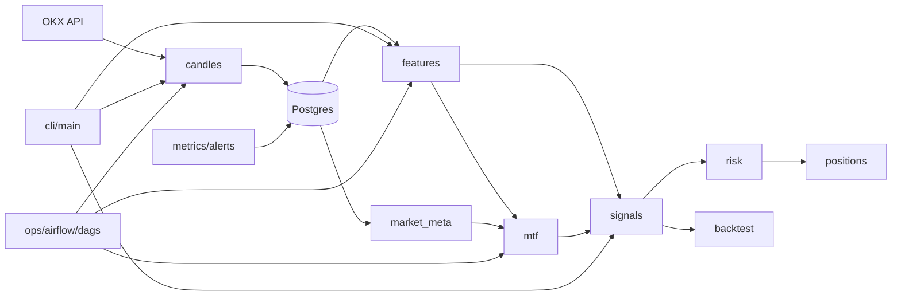
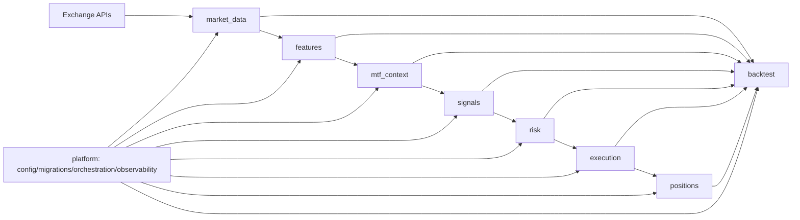

# PKLPO — Архитектура системы

**Версия:** 0.4.0 | **Обновлено:** 2026-03-17

---

## Содержание

1. [Обзор](#1-обзор)
2. [Высокоуровневая схема (текущее состояние)](#2-высокоуровневая-схема-текущее-состояние)
3. [Целевая архитектура (To-Be)](#3-целевая-архитектура-to-be)
4. [Bounded Contexts](#4-bounded-contexts)
5. [Слои и правило зависимостей](#5-слои-и-правило-зависимостей)
6. [Матрица зависимостей между контекстами](#6-матрица-зависимостей-между-контекстами)
7. [Контракты (порты)](#7-контракты-порты)
8. [Data Flow Pipeline](#8-data-flow-pipeline)
9. [Компоненты системы](#9-компоненты-системы)
10. [Схема базы данных](#10-схема-базы-данных)
11. [Конфигурация](#11-конфигурация)
12. [Airflow DAGs](#12-airflow-dags)
13. [Инварианты архитектуры](#13-инварианты-архитектуры)
14. [Миграционная стратегия](#14-миграционная-стратегия)
15. [Architectural Fitness Functions](#15-architectural-fitness-functions)
16. [Decision Log (ADR)](#16-decision-log-adr)
17. [Gap Analysis — что отделяет нас от цели](#17-gap-analysis--что-отделяет-нас-от-цели)

---

## 1. Обзор

PKLPO — enterprise-система количественной торговли криптовалютами, построенная на принципах Clean Architecture. Система обеспечивает полный цикл от получения рыночных данных до генерации торговых сигналов и управления позициями (без реального исполнения ордеров).

### Ключевые принципы

| Принцип | Описание |
|---------|----------|
| **Single Source of Truth** | Все данные хранятся в PostgreSQL |
| **Идемпотентность** | Все операции безопасны для повторного выполнения (UPSERT) |
| **No Look-Ahead Bias** | Расчеты только после закрытия бара |
| **Инкрементальность** | Watermark-based обновление (только новые данные) |
| **Observability** | Метрики и логи по умолчанию |
| **Воспроизводимость** | `run_id`, `algo_version`, `params_hash`, `snapshot_id` на каждый расчёт |

### Технологический стек

| Компонент | Технология |
|-----------|------------|
| Language | Python 3.11+ |
| Database | PostgreSQL 15+ |
| Async DB | asyncpg + SQLAlchemy 2.0 |
| Data | Pandas, NumPy, pandas-ta |
| Orchestration | Apache Airflow |
| Config | Pydantic Settings |
| Deployment | Docker, Docker Compose |

---

## 2. Высокоуровневая схема (текущее состояние)

```
┌─────────────────────────────────────────────────────────────────────────────┐
│                              EXTERNAL LAYER                                  │
├─────────────────────────────────────────────────────────────────────────────┤
│  ┌──────────────┐  ┌──────────────┐  ┌──────────────┐  ┌──────────────┐    │
│  │   OKX API    │  │   Airflow    │  │     CLI      │  │    Slack     │    │
│  │  (Exchange)  │  │ (Scheduler)  │  │  (Commands)  │  │   (Alerts)   │    │
│  └──────┬───────┘  └──────┬───────┘  └──────┬───────┘  └──────┬───────┘    │
└─────────┼──────────────────┼──────────────────┼──────────────────┼──────────┘
          ▼                  ▼                  ▼                  ▼
┌─────────────────────────────────────────────────────────────────────────────┐
│                           APPLICATION LAYER                                  │
├─────────────────────────────────────────────────────────────────────────────┤
│  ┌─────────────────────────────────────────────────────────────────────┐   │
│  │                         PIPELINE ORCHESTRATOR                        │   │
│  │   Ingest → Data QA → Market Store → Features → MTF → Signals        │   │
│  └─────────────────────────────────────────────────────────────────────┘   │
│  ┌──────────┐ ┌──────────┐ ┌──────────┐ ┌──────────┐ ┌──────────┐         │
│  │ Candles  │ │ Features │ │   MTF    │ │ Signals  │ │Positions │         │
│  │  Sync    │ │  Calc    │ │ Analysis │ │Generator │ │Calculator│         │
│  └──────────┘ └──────────┘ └──────────┘ └──────────┘ └──────────┘         │
└─────────────────────────────────────────────────────────────────────────────┘
          ▼
┌─────────────────────────────────────────────────────────────────────────────┐
│                              DOMAIN LAYER                                    │
├─────────────────────────────────────────────────────────────────────────────┤
│  ┌──────────────────┐  ┌──────────────────┐  ┌──────────────────┐          │
│  │   Indicator      │  │    Signal        │  │    Position      │          │
│  │   Specs          │  │    Rules         │  │    Models        │          │
│  └──────────────────┘  └──────────────────┘  └──────────────────┘          │
│  ┌──────────────────┐  ┌──────────────────┐  ┌──────────────────┐          │
│  │   Validators     │  │    Protocols     │  │   Risk Limits    │          │
│  └──────────────────┘  └──────────────────┘  └──────────────────┘          │
└─────────────────────────────────────────────────────────────────────────────┘
          ▼
┌─────────────────────────────────────────────────────────────────────────────┐
│                          INFRASTRUCTURE LAYER                                │
├─────────────────────────────────────────────────────────────────────────────┤
│  ┌──────────────────┐  ┌──────────────────┐  ┌──────────────────┐          │
│  │   PostgreSQL     │  │   OKX Client     │  │    Metrics       │          │
│  │   (asyncpg)      │  │   (REST API)     │  │   (Prometheus)   │          │
│  └──────────────────┘  └──────────────────┘  └──────────────────┘          │
│  ┌──────────────────┐  ┌──────────────────┐  ┌──────────────────┐          │
│  │   Migrations     │  │    Caching       │  │    Logging       │          │
│  └──────────────────┘  └──────────────────┘  └──────────────────┘          │
└─────────────────────────────────────────────────────────────────────────────┘
```

### As-Is граф зависимостей



**Проблемы текущей схемы:**
- Смешение orchestration и бизнес-логики через несколько entrypoints.
- Присутствие legacy-путей и дублей модулей.
- Контракты между доменными блоками не везде формализованы как порты.
- Конфигурация и интеграции частично распределены между несколькими слоями.

---

## 3. Целевая архитектура (To-Be)

### Граф целевых зависимостей



**Ключевые идеи:**
- Один однонаправленный поток данных и решений.
- Единый `ExecutionService` для backtest/paper/live (разные адаптеры, один контракт).
- `platform` обслуживает контексты, но не подменяет их бизнес-логику.

### Целевая структура репозитория

```
src/
  market_data/
    domain/ application/ ports/ infrastructure/ interfaces/
  features/
    domain/ application/ ports/ infrastructure/ interfaces/
  mtf_context/
    domain/ application/ ports/ infrastructure/ interfaces/
  signals/
    domain/ application/ ports/ infrastructure/ interfaces/
  risk/
    domain/ application/ ports/ infrastructure/ interfaces/
  execution/
    domain/ application/ ports/ infrastructure/ interfaces/
  positions/
    domain/ application/ ports/ infrastructure/ interfaces/
  backtest/
    domain/ application/ ports/ infrastructure/ interfaces/
  platform/
    config/ migrations/ orchestration/ observability/
```

### Маппинг: текущие директории → целевые контексты

| Текущая директория | Целевой контекст |
|--------------------|-----------------|
| `candles/`, `market_meta/`, части `db/` | `market_data` |
| `features/` | `features` |
| `mtf/` | `mtf_context` |
| `signals/` | `signals` |
| `risk/` | `risk` |
| `positions/` | `positions` |
| `backtest/` | `backtest` |
| `metrics/`, `alerts/`, `ops/`, `config/`, `settings/` | `platform` |

---

## 4. Bounded Contexts

| # | Контекст | Ответственность | Вход | Выход |
|---|----------|-----------------|------|-------|
| 1 | `market_data` | Ingest, валидация, freshness, хранение OHLCV/L2/OI/funding | API биржи, scheduler | Нормализованные данные в хранилище |
| 2 | `features` | Расчет индикаторов без side-effects | market_data read-model | Feature-set с version metadata |
| 3 | `mtf_context` | Context/triggers/consensus (без торговли) | features + market meta | Решение-кандидат (не ордер) |
| 4 | `signals` | Генерация Signal (entry/stop/take/confidence/expected_R_net) | consensus + CostModel + market constraints | Signal intent |
| 5 | `risk` | Sizing, limits, guards, kill-switch | signal intent + portfolio state | Order intent или veto |
| 6 | `execution` | Единое исполнение для backtest/paper/live (fees/slippage/latency) | order intent | Execution events |
| 7 | `positions` | Event-sourced состояние позиций, PnL, lifecycle | execution events | Position state + отчеты |
| 8 | `backtest` | WF/OOS/CPCV/DSR, оценка стратегий | Исторические данные + все контуры | Метрики и артефакты |
| 9 | `platform` | Config, миграции, оркестрация, мониторинг, CI/CD | Инфраструктурные аспекты | — |

---

## 5. Слои и правило зависимостей

### Слои внутри каждого контекста

| Слой | Содержание |
|------|-----------|
| `domain` | Сущности, value objects, доменные сервисы, правила |
| `application` | Use-cases, orchestration внутри контекста |
| `ports` | Интерфейсы входа/выхода (repository, client, publisher) |
| `infrastructure` | Реализации портов (DB, API, queues, files) |
| `interfaces` | CLI/API/Airflow adapters |

### Правило направленности (строгое)

```
interfaces → application → domain
infrastructure → ports/domain
domain НЕ импортирует application/infrastructure/interfaces
```

---

## 6. Матрица зависимостей между контекстами

### Разрешённые

| От | К |
|----|---|
| `market_data` | `platform` |
| `features` | `market_data` |
| `mtf_context` | `features`, `market_data` |
| `signals` | `mtf_context`, `market_data` |
| `risk` | `signals`, `positions` |
| `execution` | `risk`, `market_data` |
| `positions` | `execution` |
| `backtest` | `features`, `mtf_context`, `signals`, `risk`, `execution`, `positions` |
| `platform` | все (только инфраструктурная связка) |

### Запрещённые (критично)

- `signals → execution/positions`
- `risk → market_data raw ingest`
- `execution → signals/mtf internals` (кроме контракта order intent)
- Прямые импорты legacy-пакетов из новых модулей

---

## 7. Контракты (порты)

| Порт | Метод | Описание |
|------|-------|----------|
| `FeatureProviderPort` | `get_features(symbol, timeframe, ts_from, ts_to) -> FeatureFrame` | Чтение признаков |
| `ConsensusProviderPort` | `build_consensus(symbol, ts) -> ConsensusDecision` | MTF агрегация |
| `SignalServicePort` | `generate_signal(consensus, market_meta, costs) -> Signal` | Генерация сигнала |
| `RiskServicePort` | `evaluate(signal, portfolio_state) -> RiskDecision` | Риск-оценка |
| `ExecutionServicePort` | `execute(order_intent, mode) -> list[ExecutionEvent]` | Исполнение (backtest/paper/live) |
| `PositionStorePort` | `append(events)`, `get_open_positions()`, `get_pnl(run_id)` | Хранение позиций |
| `MetricsPort` | `emit(metric_name, value, labels)` | Observability |

---

## 8. Data Flow Pipeline

### Основной Pipeline

```
┌─────────────┐     ┌─────────────┐     ┌─────────────┐     ┌─────────────┐
│   INGEST    │────▶│   DATA QA   │────▶│   MARKET    │────▶│  FEATURES   │
│  (OKX API)  │     │ (Validation)│     │   STORE     │     │   CALC      │
└─────────────┘     └─────────────┘     └─────────────┘     └──────┬──────┘
                                                                   │
                   ┌───────────────────────────────────────────────┘
                   ▼
┌─────────────┐     ┌─────────────┐     ┌─────────────┐     ┌─────────────┐
│     MTF     │────▶│  CONSENSUS  │────▶│   SIGNALS   │────▶│  POSITIONS  │
│   Context   │     │ Aggregation │     │  Generator  │     │   Sizing    │
└─────────────┘     └─────────────┘     └─────────────┘     └─────────────┘
```

### Детализация этапов

| Этап | Модуль | Вход | Выход | Таблица БД |
|------|--------|------|-------|------------|
| **Ingest** | `candles/sync_swap_candles.py` | OKX API | Raw OHLCV | `swap_ohlcv_p` |
| **Features** | `features/` | OHLCV | 500+ индикаторов | `indicators` |
| **MTF Context** | `mtf/context/` | Indicators (4H, 1H) | Market Regime | `mtf_context` |
| **MTF Triggers** | `mtf/triggers/` | Indicators (5m, 1m) | Reversal Probability | `mtf_triggers` |
| **Consensus** | `mtf/consensus/` | Context + Triggers | Weighted Score | `mtf_consensus` |
| **Signals** | `signals/` | Consensus | LONG/SHORT/FLAT | `signals` |
| **Positions** | `positions/` | Signals + Risk | Order Params | `positions` |

### Watermark-based Updates

```
┌─────────────────────────────────────────────────────────────────┐
│  1. Получить watermark: MAX(timestamp) FROM indicators         │
│     WHERE symbol = :s AND timeframe = :tf                       │
├─────────────────────────────────────────────────────────────────┤
│  2. Проверить новые данные: MAX(timestamp) FROM swap_ohlcv_p   │
│     WHERE symbol = :s AND timeframe = :tf                       │
├─────────────────────────────────────────────────────────────────┤
│  3. Если ohlcv_max > indicators_max → есть работа              │
│     Загрузить OHLCV с warmup (500 баров до watermark)          │
├─────────────────────────────────────────────────────────────────┤
│  4. Рассчитать индикаторы, UPSERT в indicators                 │
└─────────────────────────────────────────────────────────────────┘
```

---

## 9. Компоненты системы

### 9.1 Candles Sync (`src/candles/`)

Синхронизация OHLCV данных с OKX.

```
src/candles/
├── sync_swap_candles.py    # Основной синхронизатор
├── load_instruments.py     # Загрузка списка инструментов
└── swap_cli.py             # CLI команды
```

- Rate limiting: 80 req/s для публичных API
- Batch size: 300 свечей за запрос
- Concurrent symbols: до 3 параллельно
- UPSERT в `swap_ohlcv_p`

### 9.2 Features Module (`src/features/`)

Расчёт 500+ технических индикаторов.

```
src/features/
├── core/                      # Главный API compute_features()
│   └── calculation.py
├── indicator_groups/          # 10 групп индикаторов
│   ├── ma.py                  # Moving Averages (EMA, SMA, WMA)
│   ├── oscillators.py         # RSI, Stochastic, CCI, Williams %R
│   ├── volatility.py          # ATR, Bollinger, Keltner
│   ├── volume.py              # OBV, VWAP, MFI, CMF
│   ├── trend.py               # ADX, MACD, Aroon, Supertrend
│   ├── candles.py             # Candlestick patterns, Heikin-Ashi
│   ├── squeeze.py             # TTM Squeeze indicators
│   ├── statistics.py          # Rolling stats, Z-score
│   └── performance.py         # Returns, Sharpe, Drawdown
├── infrastructure/
│   ├── db_operations.py       # fetch_ohlcv_df, fetch_latest_ts
│   ├── persistence/
│   │   └── inserter.py        # insert_indicators (UPSERT)
│   └── indicator_registry.py  # Централизованный реестр
├── presets/
│   └── features_calc_short_v1.py  # 24 основных индикатора
└── config.py                  # Конфигурация
```

**Data Flow:**

```
swap_ohlcv_p → fetch_ohlcv_df() → compute_features() → insert_indicators() → indicators
     │               │                   │                     │
  timestamp       DataFrame          DataFrame             UPSERT
  (ms)            ts (seconds)       + indicators          to DB
                  + OHLCV            + timestamp (ms)
```

**Важно:** `fetch_ohlcv_df` конвертирует timestamp из миллисекунд (БД) в секунды (колонка `ts`). `compute_features` ожидает колонку `timestamp` в миллисекундах.

### 9.3 MTF Module (`src/mtf/`)

Мультитаймфрейм анализ с определением режимов рынка.

```
src/mtf/
├── context/           # Определение режимов рынка (старшие ТФ)
├── triggers/          # Генерация триггеров разворота (младшие ТФ)
├── consensus/         # Взвешенная агрегация + veto логика
├── pipeline/          # Оркестрация
└── integration/       # Сохранение результатов
```

**Веса таймфреймов:**

| Timeframe | Weight | Роль |
|-----------|--------|------|
| 4H | 0.40 | Senior context |
| 1H | 0.30 | Senior context |
| 15m | 0.20 | Junior triggers |
| 5m | 0.10 | Junior triggers |

### 9.4 Risk Module (`src/risk/`)

```
src/risk/
├── limits/
│   ├── position_limits.py     # Max 5% per position
│   ├── daily_limits.py        # Max 3% daily loss
│   └── correlation_limits.py
├── guards/
│   ├── killswitch.py
│   └── circuit_breaker.py
└── config.py
```

| Лимит | Значение | Действие |
|-------|----------|----------|
| Max Position | 5% баланса | Reject order |
| Max Daily Loss | 3% баланса | Kill-switch |
| Max Total Exposure | 50% баланса | Kill-switch |
| Risk per Trade | 1-2% | Position sizing |

### 9.5 Market Meta (`src/market_meta/`)

```
src/market_meta/
├── domain/            # Instrument metadata, validators
├── infrastructure/    # OKX API client, OI/Funding/L2 loader
└── cli/
```

---

## 10. Схема базы данных

### Основные таблицы

```
┌─────────────────────┐
│    instruments      │──────┐
│ symbol (PK)         │      │
│ inst_type, tick_size│      │
│ lot_size, leverage  │      │
└─────────────────────┘      │
                             ▼
┌─────────────────────┐     ┌─────────────────────┐
│   swap_ohlcv_p      │     │     indicators      │
│ symbol (PK, FK)     │     │ symbol (PK, FK)     │
│ timeframe (PK)      │────▶│ timeframe (PK)      │
│ timestamp (PK) [ms] │     │ timestamp (PK) [ms] │
│ open/high/low/close │     │ ema_12, rsi_14, macd│
│ volume              │     │ atr_14, adx, bb_*   │
│ funding_rate, oi    │     │ ... (500+ cols)     │
└─────────────────────┘     └──────────┬──────────┘
                                       ▼
                          ┌─────────────────────┐
                          │   mtf_consensus     │
                          │ symbol/timeframe/ts │
                          │ context_regime      │
                          │ consensus_score     │
                          │ confidence, veto    │
                          └──────────┬──────────┘
                                     ▼
                          ┌─────────────────────┐
                          │      signals        │
                          │ symbol/timestamp    │
                          │ signal, confidence  │
                          │ entry_price         │
                          └─────────────────────┘
```

### Таблицы vs Партиции

| Логическое имя | Физическая таблица | Примечание |
|----------------|-------------------|------------|
| OHLCV данные | `swap_ohlcv_p` | Партиционирована по месяцам |
| Индикаторы | `indicators` | НЕ партиционирована |
| Legacy OHLCV | `ohlcv` | Пустая (не используется) |
| Legacy Indicators | `indicators_p` | Пустая (не используется) |

**Известная проблема:** Модель `OHLCV` ссылается на таблицу `ohlcv` (пустая). Фактические данные в `swap_ohlcv_p`. Функция `fetch_ohlcv_df` имеет fallback на `swap_ohlcv_p`.

### Timestamp форматы

| Место | Формат |
|-------|--------|
| `swap_ohlcv_p.timestamp` | Миллисекунды (int) |
| `indicators.timestamp` | Миллисекунды (int) |
| `fetch_ohlcv_df` возвращает `ts` | Секунды |
| `compute_features` ожидает `timestamp` | Миллисекунды |

---

## 11. Конфигурация

### Централизованная конфигурация (`src/config/`)

```python
from src.config import get_settings

settings = get_settings()
db_url = settings.db.async_url
api_key = settings.okx.api_key.get_secret_value()
batch_size = settings.features.batch_size
```

### Структура Settings

```
Settings
├── db: DatabaseSettings        # host, port, user, password, pool_size
├── okx: OKXSettings            # api_key, api_secret, passphrase (SecretStr)
├── features: FeaturesSettings  # chunk_size, batch_size, min_fill_rate
├── risk: RiskSettings          # max_leverage, daily_loss_limit, killswitch
├── cache: CacheSettings
├── logging: LoggingSettings
└── airflow: AirflowSettings
```

### Переменные окружения (.env)

```bash
POSTGRES_DB=pklpo
POSTGRES_USER=pklpo_user
POSTGRES_PASSWORD=strongpassword
DB_HOST=localhost
DB_PORT=5432
OKX_API_KEY=...
OKX_API_SECRET=...
OKX_API_PASSPHRASE=...
FEATURES_BATCH_SIZE=50000
LOG_LEVEL=INFO
```

---

## 12. Airflow DAGs

| DAG ID | Schedule | Описание |
|--------|----------|----------|
| `okx_swap_ohlcv_sync_v2` | `*/5 * * * *` | Синхронизация OHLCV с OKX |
| `features_calc_short` | `*/15 * * * *` | Расчёт 24 основных индикаторов |

**Timeframes:** `1m`, `5m`, `15m`, `30m`, `1H`, `4H`, `1D`

**Indicators (24):** EMA(12,26), RSI(14), MACD, ATR(14), ADX, Bollinger Bands и др.

---

## 13. Инварианты архитектуры

- Единый `CostModel` для backtest/paper/live.
- Единый `ExecutionService` для backtest/paper/live (разные адаптеры, один контракт).
- Все вычисления воспроизводимы (`run_id`, `algo_version`, `params_hash`, `snapshot_id`).
- No look-ahead: чтение данных только по закрытым барам.
- Идемпотентность записи на уровне ключей данных и событий.

---

## 14. Миграционная стратегия

Миграция без big-bang, через strangler pattern:

### Фаза A — Stabilize (сейчас)
- Зафиксировать import rules, запретить новые зависимости на legacy.
- Ввести ADR на каждое межмодульное изменение.
- Запустить проверку import-graph в CI.

### Фаза B — Strangler Pattern
- Для каждого legacy entrypoint создать новый фасад в целевом контексте.
- Переводить вызовы на фасад, старый путь помечать deprecated.

### Фаза C — Contract-First
- Выделить порты для связок `features↔mtf`, `signals↔risk`, `risk↔execution`.
- Перевести интеграции на порты и адаптеры.

### Фаза D — Cleanup
- Удалить `(old)`, `features_back_up`, неиспользуемые дубли.
- Упростить CLI/Airflow entrypoints до вызова application use-cases.

---

## 15. Architectural Fitness Functions

Обязательные проверки в CI:

- Проверка import-graph на запрещённые зависимости между контекстами.
- Проверка отсутствия циклов между контекстами.
- Smoke-тесты контрактов портов.
- Mypy на публичных API контекстов.

### Definition of Ready (архитектурная задача)
- Определён затрагиваемый контекст.
- Есть контракт(ы), которые меняются.
- Есть тестовый план (unit + integration + architecture checks).
- Есть стратегия миграции без downtime.

### Definition of Done (архитектурная задача)
- Реализованы контракты/адаптеры.
- Добавлены тесты и CI-checks на архитектурные ограничения.
- Обновлены docs + ADR.
- Нет новых зависимостей, нарушающих матрицу раздела 6.

---

## 16. Decision Log (ADR)

Для каждого архитектурного решения создаётся ADR по шаблону `docs/adr/ADR-YYYYMMDD-<slug>.md`:

- **Контекст/проблема**
- **Альтернативы**
- **Принятое решение**
- **Компромиссы и последствия**

---

## 17. Gap Analysis — что отделяет нас от цели

Ниже перечислено всё, что нужно исправить для достижения целевой архитектуры.

### 🔴 Критические разрывы (блокируют чистую архитектуру)

| # | Проблема | Где | Целевое состояние |
|---|----------|-----|-------------------|
| G-1 | **Нет контекста `execution`** | `src/` не содержит execution-слоя | Выделить `src/execution/` с `ExecutionServicePort`; backtest/paper/live — адаптеры |
| G-2 | **Нет формализованных портов** между контекстами | `features↔mtf`, `signals↔risk` вызывают друг друга напрямую | Ввести порты (`FeatureProviderPort`, `ConsensusProviderPort`, `SignalServicePort`, `RiskServicePort`) |
| G-3 | **Legacy таблица `ohlcv`** конфликтует с `swap_ohlcv_p` | `src/models.py`, `fetch_ohlcv_df` | Убрать fallback, перевести модель `OHLCV` на `swap_ohlcv_p` |
| G-4 | **Нет проверки import-graph в CI** | CI pipeline | Добавить `import-linter` или `pydeps` check на запрещённые зависимости |

### 🟠 Структурные проблемы (мешают масштабированию)

| # | Проблема | Где | Целевое состояние |
|---|----------|-----|-------------------|
| G-5 | **`candles/` и `market_meta/` не объединены в `market_data`** | `src/candles/`, `src/market_meta/` | Переместить в `src/market_data/` с общим `domain/`, `ports/`, `infrastructure/` |
| G-6 | **`platform` не выделен** — config/metrics/migrations разбросаны | `src/config/`, `src/metrics/`, `src/db/` | Создать `src/platform/` как единый инфраструктурный слой |
| G-7 | **CLI напрямую вызывает бизнес-логику** вместо application use-cases | `src/cli/commands/` | CLI должен знать только об `interfaces`-слое каждого контекста |
| G-8 | **Старые модули в `src/`** (`features_back_up`, файлы с `(old)`, legacy entrypoints) | `src/` | Удалить после прохождения фазы B миграции |

### 🟡 Качество кода и observability

| # | Проблема | Где | Целевое состояние |
|---|----------|-----|-------------------|
| G-9 | **Timestamp-несоответствие** не задокументировано как явный контракт | `fetch_ohlcv_df`, `compute_features` | Зафиксировать в `FeatureProviderPort`, добавить assertion/validation |
| G-10 | **Нет `run_id`/`algo_version`/`params_hash`** в расчётах | `indicators` таблица | Добавить колонки для воспроизводимости и аудита |
| G-11 | **136 ruff-ошибок** в CI (TC002, N803, SIM102, S106 и др.) | Весь `src/` | Пройти автоисправление + ручные правки (план в MEMORY.md) |
| G-12 | **`MetricsPort` не реализован** — Prometheus интеграция частичная | `src/metrics/` | Ввести единый `MetricsPort`, адаптер под Prometheus |

### 🟢 Документация и процесс

| # | Проблема | Где | Целевое состояние |
|---|----------|-----|-------------------|
| G-13 | **Нет ни одного ADR** | `docs/adr/` (не существует) | Создать папку, задокументировать ключевые решения (execution layer, partition strategy) |
| G-14 | **Нет smoke-тестов контрактов портов** | `tests/` | Добавить тесты для всех портов из раздела 7 |
| G-15 | **`TARGET_ARCHITECTURE.md` и `ARCHITECTURE.md` существовали отдельно** | Корень репо | ✅ Решено: слиты в этот файл |

---

**Последнее обновление:** 2026-03-17
