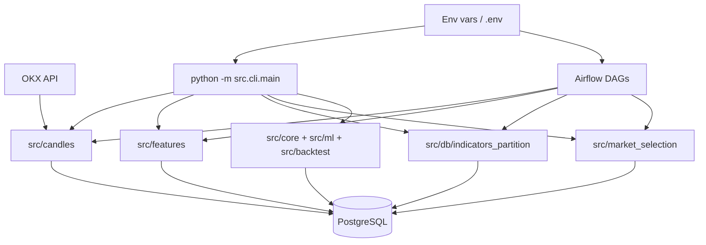
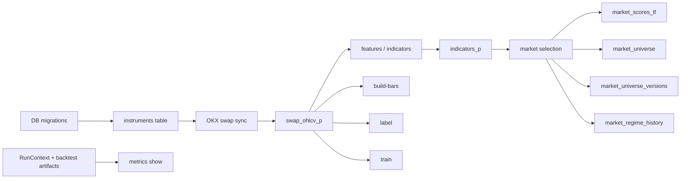
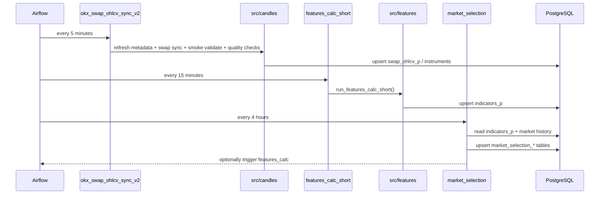

# PKLPO

PKLPO — это Python 3.11-репозиторий для загрузки рыночных данных по OKX swap, сохранения их в PostgreSQL, расчета технических индикаторов, обслуживания партиционированного хранилища и отбора торгового market universe для downstream quant-процессов.

Этот README описывает репозиторий в его текущем состоянии. Он предназначен для инженеров, работающих с живым кодом, а не с историческими схемами или планируемыми подсистемами.

## Назначение

Текущий репозиторий существует для поддержки конкретного конвейера от данных к отбору рынков:

1. Применение и сопровождение схемы PostgreSQL.
2. Загрузка и обновление метаданных инструментов.
3. Синхронизация OKX swap OHLCV в `swap_ohlcv_p`.
4. Расчет индикаторов в `indicators_p`.
5. Обслуживание месячных партиций `indicators_p`.
6. Построение scored market universe в `market_selection_*`.
7. Поддержка связанных quant-процессов: dollar bars, labeling, training и backtest metrics.

## Граница ответственности

Этот репозиторий владеет:

- схемой PostgreSQL и процессом миграций в `src/db/`
- загрузкой инструментов и свечей OKX swap в `src/candles/`
- расчетом индикаторов и их сохранением в `src/features/`
- отбором рынков и сохранением regime-данных в `src/market_selection/`
- orchestration через Airflow DAG в `ops/airflow/dags/`
- quant-утилитами на основном CLI: `build-bars`, `label`, `train`, `metrics`

Этот репозиторий сейчас не владеет:

- исполнением сделок в реальном времени
- OMS / broker connectivity
- полным end-to-end production path для каждого пакета в `src/`
- root CLI-путем для `mtf`, `signals` или `risk`, хотя эти пакеты есть в дереве

## Роль в системе

Активный поток на уровне репозитория ориентирован на хранение:

- upstream-системы поставляют рыночные данные и runtime-инфраструктуру
- этот репозиторий нормализует, сохраняет, обогащает и оценивает эти данные
- downstream-потребители читают таблицы PostgreSQL или запускают research/ML-команды поверх них



## Текущий поток данных верхнего уровня



## Плановый поток

Основной плановый операционный путь задается через Airflow DAG.



## Внутренняя структура

Репозиторий организован по bounded context, а не как один монолитный модуль.

| Путь | Текущая роль |
|---|---|
| `src/cli/` | Основной entrypoint и регистрация команд |
| `src/db/` | Запуск миграций, валидация схемы, обслуживание партиций |
| `src/candles/` | Синхронизация с OKX, каталог инструментов, quality checks, observability |
| `src/features/` | Спецификации индикаторов, движок расчета, сохранение, freshness gating |
| `src/market_selection/` | Scoring по таймфреймам, классификация regime, публикация universe |
| `src/core/` | Общие quant-примитивы, например dollar bars и run context |
| `src/ml/` | Triple-barrier labeling, validation, feature selection, metalabeling |
| `src/backtest/` | Генерация отчетов и метрик |
| `ops/airflow/dags/` | Плановая orchestration для sync, features, selection и обслуживания партиций |
| `tests/` | Тесты по модулям, включая `candles`, `features`, `db`, `market_selection`, `ml`, `backtest` |

## Публичные интерфейсы и контракты

### Основной CLI

Подтвержденный текущий entrypoint:

```bash
python -m src.cli.main --help
```

Сейчас зарегистрированы такие top-level команды:

- `migrate`
- `build-bars`
- `load-instruments`
- `swap-sync`
- `pipeline`
- `features`
- `update-list`
- `cleanup`
- `market-selection`
- `label`
- `train`
- `metrics`
- `indicators-partitions`

Важное замечание по границе ответственности:

- пакеты `mtf`, `signals` и `risk` существуют в `src/`, но сегодня не зарегистрированы в `src/cli/main.py`

### Контракты хранения

Активный путь хранения сосредоточен вокруг PostgreSQL:

- `schema_migrations` отслеживает примененные миграции
- `instruments` хранит каталог инструментов
- `swap_ohlcv_p` хранит синхронизированные swap OHLCV и дополнительные поля, включая `funding_rate` и `open_interest`
- `indicators_p` хранит рассчитанные индикаторы и служебные метаданные
- `market_scores_tf`, `market_universe`, `market_universe_versions` и `market_regime_history` хранят результаты отбора рынков

### Контракты Airflow

Активные DAG-файлы:

- `ops/airflow/dags/okx_swap_ohlcv_sync_v2.py`
- `ops/airflow/dags/features_calc_short.py`
- `ops/airflow/dags/market_selection.py`
- `ops/airflow/dags/features_calc.py`
- `ops/airflow/dags/indicators_partition_maintenance.py`

Airflow использует connection `pklpo_db` и передает runtime-параметры через `dag_run.conf`.

## Входы и выходы

### Входы

- настройки БД из `.env` и переменных окружения
- учетные данные OKX и настройки rate limit
- аргументы CLI
- конфигурация Airflow connection и variables
- существующие строки в PostgreSQL для инкрементальной обработки или freshness-gated логики

### Выходы

- перечисленные выше таблицы в БД
- логи в файлы и stdout
- опциональные Prometheus / Pushgateway-метрики для части пайплайнов
- артефакты моделей в `./artifacts` для `train`
- выходы отчетности на основе RunContext для `metrics show`

## Ключевые правила и инварианты

Эти правила отражены в текущем коде и документации:

- миграции должны быть идемпотентными и упорядочены через реестр в `src/db/migration_registry.py`
- сохранение свечей и индикаторов использует upsert-семантику с ключом по symbol, timeframe и timestamp
- `features_calc_short` подготавливает хранилище перед запуском, а не предполагает, что партиции уже существуют
- market selection сохраняет versioned outputs и может откатиться на предыдущий опубликованный universe при сбое
- CLI-команда `pipeline` содержит placeholder stages (`signals`, `scoring`, `recommendations`), которые сейчас логируются как пропущенные, а не выполняют бизнес-логику

Важно для репозитория:

- в `src/features` и `src/candles` есть более детальные поведенческие контракты, чем видно из root CLI. При изменениях внутри bounded context сначала читайте README и тесты этого модуля.

## Конфигурация

Конфигурация централизована в `src/config/settings.py` через вложенные settings-объекты:

- `DB_*` и `POSTGRES_*` для подключения к БД
- `OKX_*` для доступа к бирже, retry и rate limit
- `FEATURES_*` для chunking, validation, backend, retries и normalization
- `RISK_*`, `RETRY_*`, `CACHE_*`, `LOG_*`, `AIRFLOW_*`, `OBSERVABILITY_*`, `QUANT_*` для связанных подсистем

Важная деталь реализации:

- `src/database.py` валидирует обязательные env vars во время импорта и сразу создает async SQLAlchemy engine
- на Windows и при локальной разработке `localhost` переписывается в `127.0.0.1`, чтобы избежать проблем с IPv6

## Runbook

Используйте только команды, подтвержденные текущим деревом.

### Базовая настройка и ingest

```bash
python -m src.cli.main migrate
python -m src.cli.main update-list
python -m src.cli.main swap-sync --symbols BTC-USDT-SWAP --timeframes 1m 5m 15m
python -m src.cli.main features --symbols BTC-USDT-SWAP --timeframes 1m 5m 15m
python -m src.cli.main indicators-partitions
```

### Проверка основного CLI

```bash
python -m src.cli.main --help
```

### Quant research-команды

Эти команды есть в активном CLI, но работают как отдельные workflow, а не как часть основного планового ingest-пути:

```bash
python -m src.cli.main build-bars --symbols BTC-USDT-SWAP --dollar-value 200000
python -m src.cli.main label --symbols BTC-USDT-SWAP
python -m src.cli.main train --symbols BTC-USDT-SWAP
python -m src.cli.main metrics show --run-id <uuid>
```

### Валидация и quality gates

```bash
pytest
pytest -m "not slow and not integration"
ruff check src tests
black src tests
mypy src
pre-commit run --all-files
powershell -File scripts/check_before_commit.ps1
```

## Тестирование и отладка

При отладке выбирайте минимальную поверхность, соответствующую подсистеме, которую вы затронули:

- для CLI wiring начните с `python -m src.cli.main --help`
- для проблем со схемой выполните `python -m src.cli.main migrate`, затем смотрите `src/db/`
- для проблем синхронизации смотрите `src/candles/`, DAG `okx_swap_ohlcv_sync_v2` и таблицу `swap_ohlcv_p`
- для проблем с индикаторами смотрите `src/features/`, команду `features`, `features_calc_short` и `indicators_p`
- для проблем с universe смотрите `src/market_selection/`, команды `market-selection` и таблицы `market_selection_*`

Полезные кодовые точки входа:

- `src/cli/main.py`
- `src/cli/commands/features.py`
- `src/cli/commands/swap_sync.py`
- `src/cli/commands/indicators_partitions.py`
- `src/market_selection/interfaces/commands.py`
- `ops/airflow/dags/okx_swap_ohlcv_sync_v2.py`
- `ops/airflow/dags/features_calc_short.py`
- `ops/airflow/dags/market_selection.py`

## Поведение при ошибках и повторы

Текущее поведение различается по подсистемам:

- `src/candles` использует retry/backoff и circuit-breaker-паттерны вокруг работы с биржей и БД; недоступность БД считается жесткой остановкой для sync
- `src/features` допускает, что часть ошибок расчета может деградировать в неполные данные вместо падения всего запуска; сохранение использует retry-aware инфраструктуру upsert
- `market_selection` сохраняет versioned outcomes и может публиковать `fallback_prev` вместо пустого universe
- `indicators-partitions` безопасен по умолчанию: preview mode включен по умолчанию, а изменения схемы требуют явного `--apply`
- repo-level команда `pipeline` не является полностью реализованным orchestrator для всех заявленных stages; неподдерживаемые stages сейчас логируются как пропущенные

## Логирование и observability

Текущая observability-логика разделена по модулям:

- root CLI использует Python logging и поддерживает `--verbose` и `--quiet`
- `src/candles` поддерживает структурированные quality-метрики и Prometheus-совместимые метрики; этот модуль используется в DAG `okx_swap_ohlcv_sync_v2`
- `src/features` предоставляет Prometheus-метрики, детализированное логирование расчета/сохранения и Airflow callbacks
- `src/market_selection` записывает run metrics и предоставляет CLI-команды для диагностики: `status`, `universe`, `regime`, `metrics`, `explain`

Операционное замечание:

- Airflow DAG часто пишут логи в `/tmp/pklpo` внутри Airflow runtime

## Как безопасно расширять

### Добавить изменение схемы

1. Добавьте идемпотентную миграцию в `src/db/migrations/`.
2. Зарегистрируйте ее в `src/db/migration_registry.py`.
3. Проверьте через текущий путь миграций репозитория, прежде чем менять зависимый код.

### Добавить новую возможность ingest

1. Начинайте с `src/candles/`.
2. Обновите соответствующий interface, application use case и infrastructure adapter.
3. Сначала убедитесь, что данные попадают в ожидаемую таблицу, и только потом меняйте downstream-потребителей.

### Добавить новый индикатор или feature-workflow

1. Начинайте с `src/features/specs/` и `src/features/indicator_groups/`.
2. Проверьте `src/features/README.md` на предмет контрактов групп и сохранения.
3. Убедитесь, не нужно ли также менять схему `indicators_p` или обслуживание партиций.

### Добавить новое правило market selection

1. Начинайте с `src/market_selection/domain/`.
2. Держите изменения persistence и orchestration в `application/` и `infrastructure/`.
3. Сохраняйте fallback- и versioning-семантику, если только вы не меняете ее намеренно.

## Ограничения

- поверхность root CLI уже, чем все дерево репозитория. Часть пакетов существует, но не подключена к `src.cli.main`
- в репозитории есть и текущие, и похожие на legacy операционные пути; этот root README описывает только активные root CLI- и DAG-пути
- команда `pipeline` до сих пор объявляет стадии-заглушки
- путь через Airflow и ручной путь через CLI связаны, но не идентичны; нельзя предполагать, что у CLI-команды есть прямой плановый эквивалент без проверки DAG
- некоторые README модулей содержат больше деталей, чем root README, и для внутренних контрактов подсистем именно они должны считаться первичным источником

## Допущения и TODO

- TODO: стандартизировать, является ли `swap_ohlcv_p` единственным каноническим именем OHLCV-таблицы или `ohlcv_p` все еще используется вне legacy / compatibility-path
- TODO: решить, должна ли root-команда `pipeline` оставаться частичным orchestrator или быть сокращена до полностью реализованных стадий
- TODO: задокументировать точную операторскую bootstrap-последовательность для Airflow вне Docker, опираясь только на актуальную поддерживаемую документацию
- TODO: подтвердить, должны ли артефакты обучения моделей оставаться только локальными или стать first-class persisted output репозитория
