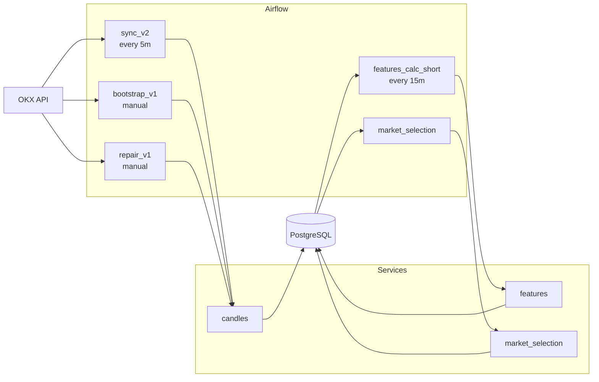
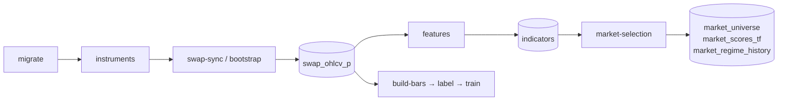
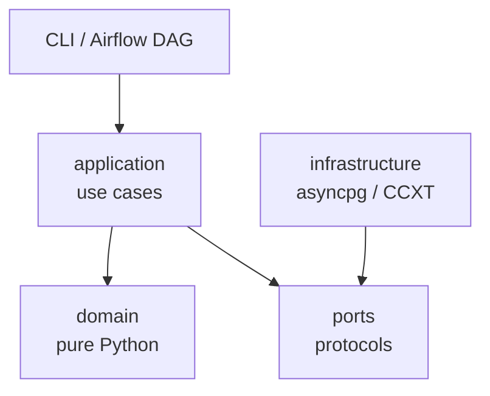

# PKLPO

Платформа для сбора, ремонта и обогащения OHLCV-свечей с OKX: от исторического backfill до технических индикаторов и отбора торгового universe.

## Возможности

- Инкрементальный live-ingest OKX swap OHLCV через Airflow
- Исторический backfill с checkpoint/resume (`bootstrap`)
- Автоматический gap detection и repair свечей
- 500+ технических индикаторов (EMA, RSI, MACD, ATR, ADX, Bollinger и др.)
- Партиционированное хранилище PostgreSQL с upsert-семантикой
- Отбор торгового universe: scoring, regime, versioned snapshots
- Quant-утилиты: dollar bars, triple-barrier labeling, обучение моделей, backtest metrics

## Стек

| Компонент | Технология |
|-----------|-----------|
| Язык | Python 3.11 |
| База данных | PostgreSQL 16 (asyncpg) |
| Оркестрация | Apache Airflow |
| Биржа | OKX (CCXT) |
| Data | Pandas, NumPy, pandas-ta |
| Config | Pydantic Settings |

## Архитектура



### Поток данных



### Clean Architecture



Правило: `domain` не импортирует `application` или `infrastructure`. Нарушение — критическая ошибка.

## Быстрый старт

### Установка

```bash
git clone https://github.com/iamsshzmn/pklpo.git
cd pklpo
cp .env.example .env        # заполни OKX_* и POSTGRES_*
```

**Windows:**

```powershell
powershell -File scripts/bootstrap.ps1
.venv\Scripts\Activate.ps1
```

**Unix:**

```bash
make setup
source .venv/bin/activate
```

### Первый запуск

```bash
python -m src.cli.main migrate
python -m src.cli.main update-list
python -m src.cli.main swap-sync --symbols BTC-USDT-SWAP --timeframes 1H 4H
python -m src.cli.main features   --symbols BTC-USDT-SWAP --timeframes 1H 4H
python -m src.cli.main market-selection
```

## Конфигурация

Скопируй `.env.example` → `.env`:

```bash
POSTGRES_DB=pklpo
POSTGRES_USER=pklpo_user
POSTGRES_PASSWORD=strongpassword
DB_HOST=localhost
DB_PORT=5432

OKX_API_KEY=...
OKX_API_SECRET=...
OKX_API_PASSPHRASE=...
```

Вся конфигурация централизована в `src/config/settings.py` через Pydantic Settings. Не используй `os.getenv()` в коде напрямую.

## CLI-команды

```
migrate               Применить миграции схемы
update-list           Обновить каталог инструментов
swap-sync             Live-синхронизация OHLCV
swap-repair           Gap detection и repair свечей
features              Расчёт индикаторов
market-selection      Отбор торгового universe
indicators-partitions Обслуживание monthly partitions
build-bars            Dollar bars
label                 Triple-barrier labeling
train                 Обучение модели
metrics               Backtest metrics
pipeline              Orchestration stub
```

## Airflow DAGs

| DAG | Расписание | Описание |
|-----|-----------|----------|
| `okx_swap_ohlcv_sync_v2` | `*/5 * * * *` | Live ingest OHLCV |
| `okx_swap_ohlcv_bootstrap_v1` | manual | Исторический backfill с checkpoint |
| `okx_swap_repair_v1` | manual | Gap detection и repair |
| `swap_ohlcv_retention` | scheduled | Retention cleanup |
| `features_calc_short` | `*/15 * * * *` | Инкрементальный расчёт индикаторов |
| `features_calc` | scheduled | Полный расчёт |
| `market_selection` | scheduled | Отбор рынков |
| `indicators_partition_maintenance` | scheduled | Monthly partitions |

## Структура проекта

```text
src/
├── candles/            # Ingest, repair, bootstrap (OKX)
├── features/           # 500+ индикаторов
├── market_selection/   # Scoring, regime, universe
├── db/                 # Миграции, registry
├── config/             # Pydantic Settings
├── cli/                # CLI entrypoint и команды
├── core/               # Dollar bars, run context
├── ml/                 # Labeling, feature selection
└── backtest/           # Отчёты и метрики

ops/airflow/dags/       # Airflow DAG-файлы
tests/                  # Тесты (зеркалируют src/)
docs/                   # ARCHITECTURE.md, ENGINEERING_GUIDE.md
```

## Тестирование

```bash
make lint        # ruff check + format
make typecheck   # mypy src
make test        # быстрые тесты (без slow/integration)
make check       # всё сразу
make test-all    # включая integration
```

Целевое покрытие: **85%** (enforced в `pyproject.toml`).

## Схема базы данных

| Таблица | Описание |
|---------|----------|
| `instruments` | Каталог инструментов |
| `swap_ohlcv_p` | OHLCV-свечи (partitioned, source of truth) |
| `ops.swap_ohlcv_bootstrap_state` | Bootstrap checkpoint + coverage cache |
| `indicators` | Рассчитанные индикаторы |
| `market_scores_tf` | Scoring по таймфреймам |
| `market_universe` | Отобранный universe |
| `market_universe_versions` | Версионированные снапшоты |
| `market_regime_history` | История режимов рынка |

## Roadmap

- [x] Live OHLCV ingest с OKX
- [x] Исторический bootstrap с checkpoint/resume
- [x] Gap detection и repair pipeline
- [x] 500+ индикаторов с watermark-based updates
- [x] Market selection: scoring, regime, versioned universe
- [x] Quant-утилиты (bars, labeling, training, metrics)
- [ ] Выделить `execution` контекст (backtest/paper/live)
- [ ] Формализовать порты между контекстами (`FeatureProviderPort`, `SignalServicePort`)
- [ ] Import-graph checks в CI
- [ ] `MetricsPort` с Prometheus-адаптером

## Документация

- [`docs/ARCHITECTURE.md`](docs/ARCHITECTURE.md) — bounded contexts, layer rules, ADRs
- [`docs/ARCHITECTURE_GUIDE.md`](docs/ARCHITECTURE_GUIDE.md) — как применять архитектуру на практике
- [`docs/ENGINEERING_GUIDE.md`](docs/ENGINEERING_GUIDE.md) — соглашения, тестирование, workflow
- [`ops/airflow/dags/README.md`](ops/airflow/dags/README.md) — полный каталог DAG и расписания
