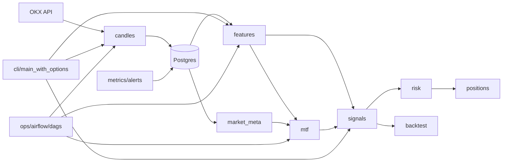
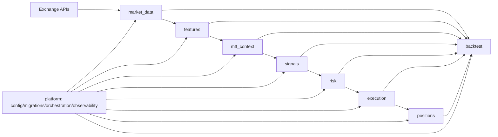

# Target Architecture (PKLPO)

## 1. Назначение
Этот документ фиксирует целевую архитектуру системы: границы модулей, допустимые зависимости, правила интеграции и миграционный путь от текущей структуры `src/` к устойчивой модели.

Связанные документы:
- `plan/ROADMAP_2.0.md`
- `plan/ROADMAP.md`
- `src/FEATURES_DEPENDENCIES.md`

## 2. Проблемы текущего состояния
- В `src/` одновременно присутствуют актуальные и legacy-модули (`(old)`, `features_back_up`, старые entrypoints).
- Есть локальные циклические и «широкие» зависимости через CLI/DB утилиты.
- Контракты между доменными блоками не везде формализованы как порты.
- Конфигурация и интеграции частично распределены между несколькими слоями.

## 3. Целевая модель (Bounded Contexts)

### 3.1 Контексты
1. `market_data`
- Ответственность: ingest, валидация, freshness, хранение OHLCV/L2/OI/funding.
- Вход: API биржи, scheduler.
- Выход: нормализованные данные в хранилище.

2. `features`
- Ответственность: расчет индикаторов/признаков без side-effects.
- Вход: market_data read-model.
- Выход: feature-set с version metadata.

3. `mtf_context`
- Ответственность: context/triggers/consensus (без торговли).
- Вход: features + market meta.
- Выход: решение-кандидат (не ордер).

4. `signals`
- Ответственность: генерация Signal (entry/stop/take/confidence/expected_R_net).
- Вход: consensus + CostModel + market constraints.
- Выход: signal intent.

5. `risk`
- Ответственность: sizing, limits, guards, kill-switch.
- Вход: signal intent + portfolio state.
- Выход: order intent или veto.

6. `execution`
- Ответственность: единое исполнение для backtest/paper/live (fees/slippage/IS/%ADV/latency).
- Вход: order intent.
- Выход: execution events.

7. `positions`
- Ответственность: event-sourced состояние позиций, PnL, lifecycle.
- Вход: execution events.
- Выход: position state + отчеты.

8. `backtest`
- Ответственность: WF/OOS/CPCV/DSR, оценка стратегий.
- Вход: исторические данные + signal/risk/execution контуры.
- Выход: метрики и артефакты исследований.

9. `platform`
- Ответственность: конфиг, миграции, оркестрация, мониторинг, CI/CD.
- Вход/выход: инфраструктурные аспекты.

## 3.3 Архитектурная схема: As-Is (сейчас)



Проблемы текущей схемы:
- смешение orchestration и бизнес-логики через несколько entrypoints;
- присутствие legacy-путей и дублей модулей;
- не везде явно выделены порты/адаптеры между доменными блоками.

## 3.4 Архитектурная схема: To-Be (цель)



Ключевая идея целевой схемы:
- одна направленность потока данных и решений (слева направо);
- единый execution path для backtest/paper/live;
- platform слой обслуживает контексты, но не подменяет их бизнес-логику.

### 3.5 Mapping с текущими директориями
- `candles`, `market_meta`, части `db` -> `market_data`
- `features` -> `features`
- `mtf` -> `mtf_context`
- `signals` -> `signals`
- `risk` -> `risk`
- `positions` -> `positions`
- `backtest` -> `backtest`
- `metrics`, `alerts`, `ops` + infra части `config/settings` -> `platform`

## 4. Слои и правило направленности зависимостей

### 4.1 Слои
- `domain`: сущности, value objects, доменные сервисы, правила.
- `application`: use-cases, orchestration внутри контекста.
- `ports`: интерфейсы входа/выхода (repository, client, publisher).
- `infrastructure`: реализации портов (DB, API, queues, files).
- `interfaces`: CLI/API/Airflow adapters.

### 4.2 Жесткое правило
Зависимости направлены только внутрь:
- `interfaces -> application -> domain`
- `infrastructure -> ports/domain`
- `domain` не импортирует `application/infrastructure/interfaces`.

## 5. Матрица зависимостей между контекстами

Разрешенные зависимости:
- `market_data -> platform`
- `features -> market_data`
- `mtf_context -> features, market_data`
- `signals -> mtf_context, market_data`
- `risk -> signals, positions`
- `execution -> risk, market_data`
- `positions -> execution`
- `backtest -> features, mtf_context, signals, risk, execution, positions`
- `platform -> *` (только инфраструктурная связка, не бизнес-логика)

Запрещенные зависимости (критично):
- `signals -> execution/positions`
- `risk -> market_data raw ingest`
- `execution -> signals/mtf internals` (кроме контракта order intent)
- прямые импорты legacy-пакетов из новых модулей.

## 6. Контракты (минимальный обязательный набор)

1. `FeatureProviderPort`
- `get_features(symbol, timeframe, ts_from, ts_to) -> FeatureFrame`

2. `ConsensusProviderPort`
- `build_consensus(symbol, ts) -> ConsensusDecision`

3. `SignalServicePort`
- `generate_signal(consensus, market_meta, costs) -> Signal`

4. `RiskServicePort`
- `evaluate(signal, portfolio_state) -> RiskDecision`

5. `ExecutionServicePort`
- `execute(order_intent, mode) -> list[ExecutionEvent]`

6. `PositionStorePort`
- `append(events)`, `get_open_positions()`, `get_pnl(run_id)`

7. `MetricsPort`
- `emit(metric_name, value, labels)`

## 7. Инварианты архитектуры
- Единый `CostModel` для backtest/paper/live.
- Единый `ExecutionService` для backtest/paper/live (разные адаптеры, один контракт).
- Все вычисления воспроизводимы (`run_id`, `algo_version`, `params_hash`, `snapshot_id`).
- No look-ahead: чтение данных только по закрытым барам.
- Идемпотентность записи на уровне ключей данных и событий.

## 8. Структура репозитория (целевая)

```text
src/
  market_data/
    domain/ application/ ports/ infrastructure/ interfaces/
  features/
    domain/ application/ ports/ infrastructure/ interfaces/
  mtf_context/
    domain/ application/ ports/ infrastructure/ interfaces/
  signals/
    domain/ application/ ports/ infrastructure/ interfaces/
  risk/
    domain/ application/ ports/ infrastructure/ interfaces/
  execution/
    domain/ application/ ports/ infrastructure/ interfaces/
  positions/
    domain/ application/ ports/ infrastructure/ interfaces/
  backtest/
    domain/ application/ ports/ infrastructure/ interfaces/
  platform/
    config/ migrations/ orchestration/ observability/
```

## 9. Миграционная стратегия (без big-bang)

Фаза A (stabilize):
- Зафиксировать import rules и запретить новые зависимости на legacy.
- Ввести ADR на каждое межмодульное изменение.

Фаза B (strangler pattern):
- Для каждого legacy entrypoint создать новый фасад в целевом контексте.
- Переводить вызовы на фасад, старый путь помечать deprecated.

Фаза C (contract-first):
- Выделить порты для связок `features<->mtf`, `signals<->risk`, `risk<->execution`.
- Перевести интеграции на порты и адаптеры.

Фаза D (cleanup):
- Удалить `(old)`, `features_back_up`, неиспользуемые дубли.
- Упростить CLI/airflow entrypoints до вызова application use-cases.

## 10. Architectural Fitness Functions
Проверки в CI (обязательно):
- Проверка import-graph на запрещенные зависимости.
- Проверка отсутствия циклов между контекстами.
- Smoke-тесты контрактов портов.
- Mypy на публичных API контекстов.

## 11. Decision Log (обязательное правило)
Для каждого архитектурного решения создается ADR:
- Контекст/проблема.
- Альтернативы.
- Принятое решение.
- Компромиссы и последствия.

Шаблон: `docs/adr/ADR-YYYYMMDD-<slug>.md`.

## 12. Definition of Ready для архитектурной задачи
- Определен затрагиваемый контекст.
- Есть контракт(ы), которые меняются.
- Есть тестовый план (unit + integration + architecture checks).
- Есть стратегия миграции без downtime/без поломки DAG.

## 13. Definition of Done для архитектурной задачи
- Реализованы контракты/адаптеры.
- Добавлены тесты и CI-checks на архитектурные ограничения.
- Обновлены docs + ADR.
- Нет новых зависимостей, нарушающих матрицу раздела 5.
