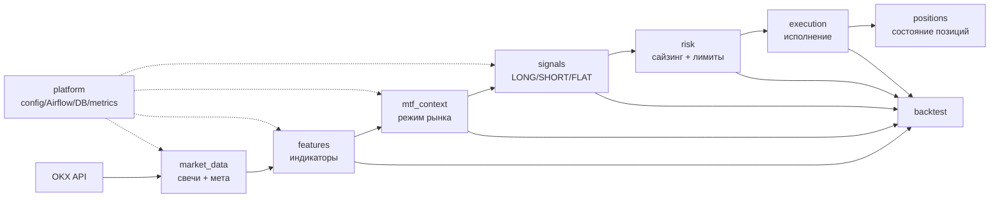
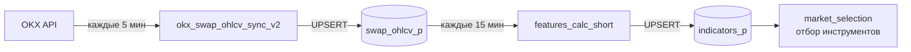

# PKLPO — Ментальная модель

> Это навигационная карта проекта: как читать структуру, куда смотреть, как всё связано.
> Детали — в `ARCHITECTURE.md` и `DATA_FLOW.md`. Здесь — принципы и схемы.

---

## Одна фраза о проекте

**PKLPO** — система, которая каждые 5 минут забирает свечи с OKX, считает технические индикаторы, определяет рыночный режим, генерирует торговые сигналы и управляет позициями. До реального исполнения ордеров система ещё не дошла.

---

## 1. Главная идея: однонаправленный поток

Данные идут строго в одну сторону. Каждый блок берёт результат предыдущего, добавляет свою работу, передаёт дальше.



**Важно:** стрелки только в одну сторону. `signals` не знает про `execution`, `risk` не знает про `market_data`.

---

## 2. Что реально работает сейчас (As-Is)

Из 9 контекстов в production Airflow-контуре сейчас активны только два:



Остальные модули (`mtf`, `signals`, `risk`, `positions`) — **код есть, в pipeline не включены**.

---

## 3. Bounded Contexts: 9 блоков, каждый со своей зоной ответственности

| # | Контекст | Что делает | Вход | Выход | Статус |
|---|----------|-----------|------|-------|--------|
| 1 | **market_data** | Забирает свечи с OKX, валидирует, хранит | OKX REST API | `swap_ohlcv_p` | ✅ Работает |
| 2 | **features** | Считает 500+ индикаторов (RSI, EMA, ATR...) | `swap_ohlcv_p` | `indicators_p` | ✅ Работает (short preset) |
| 3 | **mtf_context** | Определяет режим рынка по нескольким ТФ | indicators | `mtf_consensus` | 🔧 Код есть, не в pipeline |
| 4 | **signals** | Генерирует LONG/SHORT/FLAT + уровни | consensus | `signals` | 🔧 Код есть, не в pipeline |
| 5 | **risk** | Сайзинг позиции, лимиты, kill-switch | signal + портфель | order intent | 🔧 Код есть, не в pipeline |
| 6 | **execution** | Исполнение (backtest/paper/live — один контракт) | order intent | execution events | ❌ Не реализован |
| 7 | **positions** | Event-sourced состояние позиций и PnL | execution events | position state | 🔧 Код есть, не в pipeline |
| 8 | **backtest** | WF/OOS, оценка стратегий | история + все контуры | метрики | 🔧 Частично |
| 9 | **platform** | Config, миграции, Airflow, метрики | — | — | ✅ Работает |

---

## 4. Слои внутри каждого контекста

Каждый блок устроен одинаково. Правило: **зависимости идут только внутрь**.

```
interfaces/        ← CLI-команды, Airflow-таски, HTTP-эндпоинты
    │
    ▼
application/       ← use-cases, оркестрация (что и в каком порядке)
    │
    ▼
domain/            ← бизнес-логика, правила, валидаторы (чистый Python, ноль I/O)
    │
    ▼
ports/             ← интерфейсы (протоколы/ABC) для внешних зависимостей
    │
    ▼
infrastructure/    ← реализации портов: asyncpg, OKX HTTP, файлы
```

**Нарушить нельзя:** `domain/` не должен ничего импортировать из `application/` или `infrastructure/`.

### Где что искать в коде

| Слой | Пример пути |
|------|-------------|
| CLI-команды | `src/cli/commands/features.py` |
| Use-case | `src/candles/application/sync/use_cases.py` |
| Репозиторий (порт→реализация) | `src/candles/repository.py` |
| Валидаторы | `src/candles/domain/` |
| DAG-и | `ops/airflow/dags/` |

---

## 5. База данных: какие таблицы и для чего

```
instruments          — справочник торговых пар (symbol, tick_size, lot_size...)
        │
        ▼
swap_ohlcv_p         — OHLCV свечи, партиционированы по месяцам. SOURCE OF TRUTH.
        │
        ▼
indicators_p         — рассчитанные индикаторы (500+ колонок)
(= features_1h/4h/1d в документации — это одна таблица, transitional inconsistency)
        │
        ▼
candle_eligibility   — флаги: can_score / can_compute_features по каждому символу/ТФ
        │
        ▼
market_selection_results — отобранный universe (фильтровать WHERE selected = TRUE)
        │
        ▼
mtf_consensus        — режим рынка + веса (целевое, не в prod)
        │
        ▼
signals              — торговые сигналы (целевое, не в prod)
```

### Три вещи, которые легко перепутать

1. **`swap_ohlcv_p` vs `ohlcv`** — `ohlcv` пустая legacy-таблица, данные только в `swap_ohlcv_p`.
2. **`indicators_p` vs `indicators`** — сейчас пишется в `indicators_p`, `indicators` в коде упоминается но как цель.
3. **Timestamp** — в БД всегда **миллисекунды**, но внутри `fetch_ohlcv_df()` временно появляются секунды (`ts`). При переходе между слоями нужна явная конвертация.

---

## 6. Airflow DAGs: расписание и задачи

```
Каждые 5 мин:   okx_swap_ohlcv_sync_v2
                 refresh_okx_meta → swap_sync → validate → smoke_validate → quality_pipeline

Каждые 15 мин:  features_calc_short
                 (short preset: ma, oscillators, volatility, volume, trend)

Вручную:        features_calc          — полный расчет всех индикаторов
                okx_swap_repair_v1     — починка пропусков в истории
                okx_swap_ohlcv_bootstrap_v1 — загрузка истории с checkpoint/resume

Scheduled (отдельно):
                market_selection       — отбор торгуемого universe
                indicators_partition_maintenance — обслуживание партиций
                swap_ohlcv_retention   — очистка старых данных
```

---

## 7. Принципы, на которых держится система

| Принцип | Что значит на практике |
|---------|----------------------|
| **Идемпотентность** | Любой запуск можно повторить — данные не задублируются (UPSERT по `symbol+timeframe+timestamp`) |
| **Watermark** | Каждый шаг помнит, до какого timestamp дошёл, и обрабатывает только новое |
| **No look-ahead bias** | Индикаторы считаются только по закрытым барам |
| **Воспроизводимость** | К каждому расчёту привязаны `run_id`, `algo_version`, `params_hash` (цель, пока не везде реализовано) |
| **Eligibility gate** | Перед расчётом фич проверяется: достаточно ли истории у инструмента? (`candle_eligibility`) |

---

## 8. MTF: как работает многотаймфреймовый анализ

Идея: решение о торговле нельзя принимать только по одному таймфрейму.

```
4H (вес 0.40) ─┐
1H (вес 0.30) ─┤ → Context (режим: trend/range/reversal)
               │
15m (вес 0.20)─┤ → Triggers (точка входа)
5m  (вес 0.10)─┘
               │
               ▼
          Consensus (взвешенная оценка + veto)
               │
               ▼
          Signal (LONG / SHORT / FLAT)
```

Старшие таймфреймы (4H, 1H) определяют **режим** рынка. Младшие (15m, 5m) — **момент** входа.

---

## 9. Что значат ключевые термины

| Термин | Что это |
|--------|---------|
| `swap` | Бессрочные фьючерсы (perpetual swaps) на OKX — основной тип инструментов |
| `OHLCV` | Open/High/Low/Close/Volume — стандартная свеча |
| `indicators_p` | Таблица с 500+ техническими индикаторами, рассчитанными по каждой свече |
| `eligibility` | Флаг: достаточно ли у инструмента истории для расчёта индикаторов |
| `watermark` | Последний обработанный timestamp — граница "что уже сделано" |
| `warmup` | Дополнительные бары в начале окна, чтобы индикаторы успели "разогреться" |
| `market_selection` | Фильтрация тысяч пар до торгуемого universe по качеству данных и метрикам |
| `consensus` | Взвешенная оценка по нескольким таймфреймам: стоит ли торговать и в какую сторону |
| `run_id` | Уникальный ID расчёта для воспроизводимости результатов |
| `bootstrap` | Режим загрузки полной истории свечей с нуля (с checkpoint, можно прерывать и продолжать) |

---

## 10. Навигационная карта: где искать что

| Задача | Куда смотреть |
|--------|--------------|
| Понять архитектурное решение | `docs/ARCHITECTURE.md` §4–§8, §16 (ADR) |
| Понять реальный поток данных | `docs/DATA_FLOW.md` |
| Найти правила слоёв для candles | `.claude/rules/candles.md` |
| Найти список фич и их таблицы | `feature_registry.yaml` (семантика), `src/features/indicator_groups/registry.py` (runtime) |
| Понять DAG-расписание | `ops/airflow/dags/README.md` |
| Добавить новый индикатор | `src/features/indicator_groups/` + `feature_registry.yaml` |
| Изменить логику синхронизации | `src/candles/application/` |
| Конфигурация и env-переменные | `src/config/settings.py`, `.env.example` |
| Текущий tech debt | `docs/ARCHITECTURE.md` §17 |
| Роадмап | `docs/ROADMAP.md` |

---

*Документ отражает состояние проекта на июнь 2026. Обновлять вместе с `ARCHITECTURE.md` при смене статуса контекстов.*
