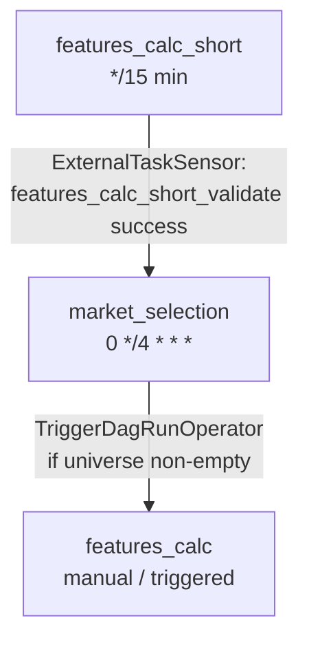
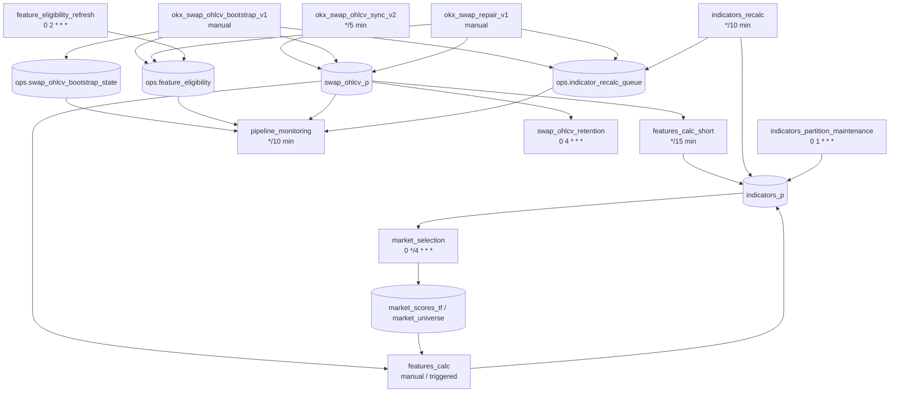

# DAG Dependency Schema

This document describes dependencies between DAGs in this directory.

## Explicit Airflow Dependencies



The only explicit cross-DAG orchestration currently found in code is:

```text
features_calc_short -> market_selection -> features_calc
```

- `market_selection` waits for `features_calc_short.features_calc_short_validate`.
- `market_selection` triggers `features_calc` when the produced universe is not empty.

## Data Dependencies



## DAG Summary

### okx_swap_ohlcv_sync_v2

Fresh OKX SWAP OHLCV ingestion.

Task chain:

```text
refresh_okx_meta
-> swap_sync
-> validate_swap_sync_xcom
-> smoke_validate
-> quality_pipeline
```

Primary output: `swap_ohlcv_p`.

### okx_swap_ohlcv_bootstrap_v1

Manual historical OHLCV backfill.

Task chain:

```text
validate_conf
-> preflight_instrument_check
-> init_bootstrap_state
-> coverage_report
-> bootstrap_symbol_tf
-> validate_bootstrap_xcom
-> enqueue_indicator_recalc
-> publish_bootstrap_report
-> publish_bootstrap_ops
-> refresh_eligibility
```

Primary outputs:

- `swap_ohlcv_p`
- `ops.swap_ohlcv_bootstrap_state`
- `ops.indicator_recalc_queue`
- `ops.feature_eligibility`

### okx_swap_repair_v1

Manual gap/corruption repair for OHLCV data.

Task chain:

```text
validate_swap_repair_conf
-> ensure_instruments_loaded
-> preflight_instrument_check
-> swap_repair_preview
-> swap_repair
-> validate_swap_repair_xcom
-> enqueue_indicator_recalc
-> publish_report
-> publish_swap_repair_ops
-> refresh_eligibility
```

Primary outputs:

- `swap_ohlcv_p`
- `ops.indicator_recalc_queue`
- `ops.swap_repair_audit`
- `ops.feature_eligibility`
- Pushgateway repair metrics

### features_calc_short

Incremental feature calculation from `swap_ohlcv_p` into `indicators_p`.

Task chain:

```text
features_calc_short_run
-> features_calc_short_validate
```

Explicit downstream DAG: `market_selection`.

### market_selection

Builds the tradable market universe and triggers full feature calculation.

Task graph:

```text
branch_wait_for_features
-> [skip_wait_for_features_calc_short | wait_for_features_calc_short]
-> run_migrations
-> run_pipeline
-> validate_universe
-> prepare_features_calc_trigger
-> branch_skip_or_trigger
-> [skip_features_calc_trigger | trigger_features_calc]

validate_universe
-> branch_cleanup_daily
-> [cleanup_old_market_selection_data | skip_cleanup_old_market_selection_data]
```

Explicit upstream DAG: `features_calc_short`.

Explicit downstream DAG: `features_calc`.

Primary outputs:

- `market_scores_tf`
- `market_universe`
- `market_universe_versions`
- `market_regime_history`

### features_calc

Full feature calculation. Can be run manually or triggered by `market_selection`.

Task chain:

```text
features_run
-> smoke_validate_features
-> combinations_run
```

Primary inputs:

- `swap_ohlcv_p`
- optional symbol universe from `market_selection`

Primary output: `indicators_p`.

### indicators_recalc

Drains persisted recalculation requests.

Task:

```text
drain_indicator_recalc_queue
```

Primary input: `ops.indicator_recalc_queue`.

Primary output: `indicators_p`.

### feature_eligibility_refresh

Daily materialized eligibility refresh.

Task:

```text
refresh_eligibility
```

Primary output: `ops.feature_eligibility`.

### pipeline_monitoring

Read-only operational health snapshot.

Task:

```text
collect_pipeline_monitoring
```

Primary inputs:

- `swap_ohlcv_p`
- `ops.indicator_recalc_queue`
- `ops.swap_ohlcv_bootstrap_state`
- `ops.feature_eligibility`

Primary output: Pushgateway monitoring metrics.

### swap_ohlcv_retention

Scheduled retention cleanup for `swap_ohlcv_p`.

Task:

```text
cleanup_swap_ohlcv
```

Primary input/output: `swap_ohlcv_p`.

### indicators_partition_maintenance

Monthly partition maintenance for `indicators_p`.

Task chain:

```text
ensure_indicators_partitions
-> validate_partition_horizon
```

Primary target: `indicators_p`.
