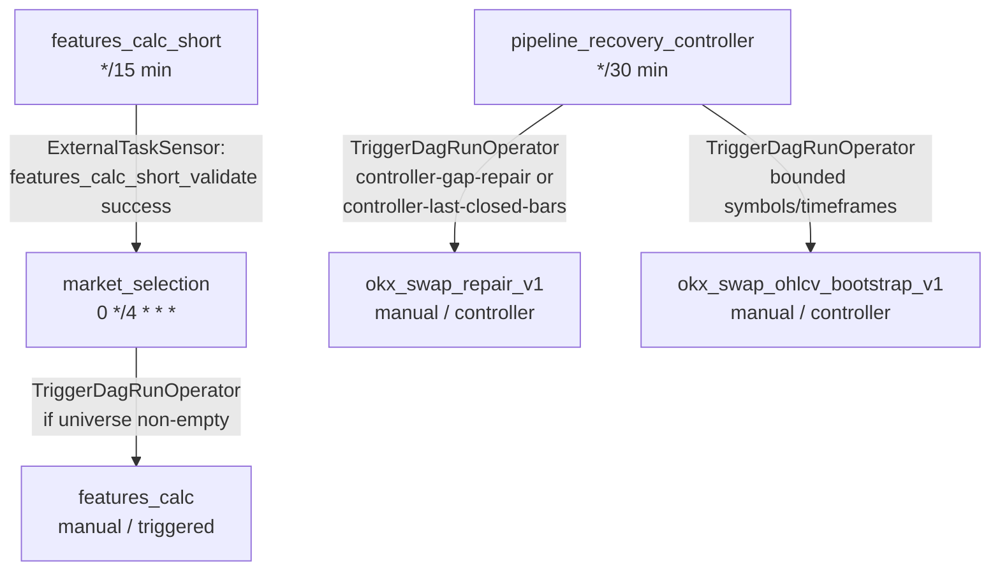
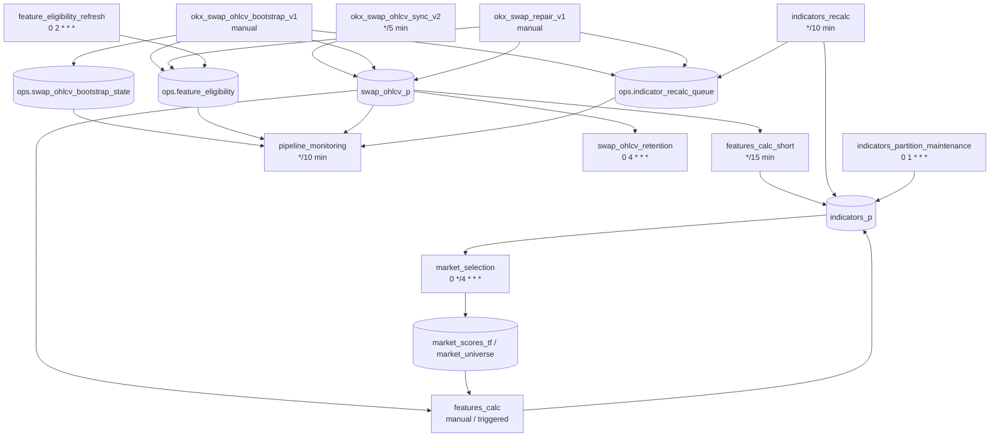

# DAG Dependency Schema

This document describes dependencies between DAGs in this directory.

## Explicit Airflow Dependencies



Explicit cross-DAG orchestration:

```text
features_calc_short -> market_selection -> features_calc
pipeline_recovery_controller -> okx_swap_repair_v1       (controller trigger presets)
pipeline_recovery_controller -> okx_swap_ohlcv_bootstrap_v1  (bounded bootstrap trigger)
```

- `market_selection` waits for `features_calc_short.features_calc_short_validate`.
- `market_selection` triggers `features_calc` when the produced universe is not empty.
- `pipeline_recovery_controller` triggers `okx_swap_repair_v1` using the
  `controller-gap-repair` or `controller-last-closed-bars` preset with bounded
  `symbols` and `timeframes` from the decision conf.
- `pipeline_recovery_controller` triggers `okx_swap_ohlcv_bootstrap_v1` with
  explicit bounded `symbols` and `timeframes` only when bootstrap state is
  missing, incomplete, stuck, or reconcile-downgraded.
- Both target DAGs enforce that controller triggers must include explicit, bounded
  `symbols`/`timeframes`; unbounded or null values are rejected at validation time.

## Data Dependencies



## DAG Summary

### okx_swap_ohlcv_sync_v2

Fresh OKX SWAP OHLCV ingestion.

Task chain:

```text
refresh_okx_meta
-> swap_sync
-> validate_swap_sync_xcom
-> smoke_validate
-> quality_pipeline
```

Primary output: `swap_ohlcv_p`.

### pipeline_recovery_controller

Scheduled decision controller for automatic recovery orchestration. Dry mode by default.

Task graph:

```text
collect_recovery_state
-> choose_recovery_action
-> branch_recovery_action
-> [trigger_repair | trigger_bootstrap | skip_recovery]
-> record_controller_completion
```

Schedule: `*/30 * * * *`. `max_active_runs=1`. `catchup=False`.

Current phase: **dry mode** — `DRY_MODE=True` in the DAG file. Branch always goes
to `skip_recovery`. Trigger tasks exist but do not fire. Decision rows are written to
`ops.pipeline_recovery_decisions` every run.

Controller trigger presets used when triggering `okx_swap_repair_v1`:

| Preset | Strategy | Symbols | Timeframes |
|--------|----------|---------|------------|
| `controller-gap-repair` | GAP_REPAIR | bounded from conf | 1H, 4H |
| `controller-last-closed-bars` | last_n_closed_bars | bounded from conf | 1H, 4H, 1D, 1W, 1M |

Both presets reject missing or unbounded `symbols`. Manual `repair-all-swaps` and
`last-200-guard` triggers are unaffected.

Bootstrap trigger: passes `triggered_by=pipeline_recovery_controller`,
`controller_decision_id`, `reason`, `symbols`, and `timeframes`. Bootstrap DAG
rejects controller triggers without explicit bounded `symbols`/`timeframes`.

Primary output: `ops.pipeline_recovery_decisions`.

Audit reason enum: `dependency_unhealthy`, `conflicting_recovery_active`,
`cooldown_active`, `rate_limit_no_candidates`, `no_recovery_needed`,
`bootstrap_state_missing`, `bootstrap_state_incomplete`,
`bootstrap_state_reconciled_incomplete`, `repair_gap_detected`,
`repair_corrupted_recent_closed_bars`, `precheck_guardrail_risk`,
`trigger_failed`, `triggered`.

Safety rules:
- Does not repair while bootstrap is active.
- Does not bootstrap while repair is active.
- Cooldown key: `action_kind + target_dag_id + symbol + timeframe`.
- Default cooldown: 240 minutes.
- Per-run limits: max 3 symbols, 2 timeframes, 6 pairs.
- Fail closed: any dependency/inspection failure → skip + audit reason.

### okx_swap_ohlcv_bootstrap_v1

Manual historical OHLCV backfill. Also triggered by `pipeline_recovery_controller`.

Task chain:

```text
validate_conf
-> preflight_instrument_check
-> init_bootstrap_state
-> coverage_report
-> bootstrap_symbol_tf
-> validate_bootstrap_xcom
-> enqueue_indicator_recalc
-> publish_bootstrap_report
-> publish_bootstrap_ops
-> refresh_eligibility
```

Primary outputs:

- `swap_ohlcv_p`
- `ops.swap_ohlcv_bootstrap_state`
- `ops.indicator_recalc_queue`
- `ops.feature_eligibility`

### okx_swap_repair_v1

Manual gap/corruption repair for OHLCV data.

Task chain:

```text
validate_swap_repair_conf
-> ensure_instruments_loaded
-> preflight_instrument_check
-> swap_repair_preview
-> swap_repair
-> validate_swap_repair_xcom
-> enqueue_indicator_recalc
-> publish_report
-> publish_swap_repair_ops
-> refresh_eligibility
```

Primary outputs:

- `swap_ohlcv_p`
- `ops.indicator_recalc_queue`
- `ops.swap_repair_audit`
- `ops.feature_eligibility`
- Pushgateway repair metrics

### features_calc_short

Incremental feature calculation from `swap_ohlcv_p` into `indicators_p`.

Task chain:

```text
features_calc_short_run
-> features_calc_short_validate
```

Explicit downstream DAG: `market_selection`.

### market_selection

Builds the tradable market universe and triggers full feature calculation.

Task graph:

```text
branch_wait_for_features
-> [skip_wait_for_features_calc_short | wait_for_features_calc_short]
-> run_migrations
-> run_pipeline
-> validate_universe
-> prepare_features_calc_trigger
-> branch_skip_or_trigger
-> [skip_features_calc_trigger | trigger_features_calc]

validate_universe
-> branch_cleanup_daily
-> [cleanup_old_market_selection_data | skip_cleanup_old_market_selection_data]
```

Explicit upstream DAG: `features_calc_short`.

Explicit downstream DAG: `features_calc`.

Primary outputs:

- `market_scores_tf`
- `market_universe`
- `market_universe_versions`
- `market_regime_history`

### features_calc

Full feature calculation. Can be run manually or triggered by `market_selection`.

Task chain:

```text
features_run
-> smoke_validate_features
-> combinations_run
```

Primary inputs:

- `swap_ohlcv_p`
- optional symbol universe from `market_selection`

Primary output: `indicators_p`.

### indicators_recalc

Drains persisted recalculation requests.

Task:

```text
drain_indicator_recalc_queue
```

Primary input: `ops.indicator_recalc_queue`.

Primary output: `indicators_p`.

### feature_eligibility_refresh

Daily materialized eligibility refresh.

Task:

```text
refresh_eligibility
```

Primary output: `ops.feature_eligibility`.

### pipeline_monitoring

Read-only operational health snapshot.

Task:

```text
collect_pipeline_monitoring
```

Primary inputs:

- `swap_ohlcv_p`
- `ops.indicator_recalc_queue`
- `ops.swap_ohlcv_bootstrap_state`
- `ops.feature_eligibility`

Primary output: Pushgateway monitoring metrics.

### swap_ohlcv_retention

Scheduled retention cleanup for `swap_ohlcv_p`.

Task:

```text
cleanup_swap_ohlcv
```

Primary input/output: `swap_ohlcv_p`.

### indicators_partition_maintenance

Monthly partition maintenance for `indicators_p`.

Task chain:

```text
ensure_indicators_partitions
-> validate_partition_horizon
```

Primary target: `indicators_p`.
