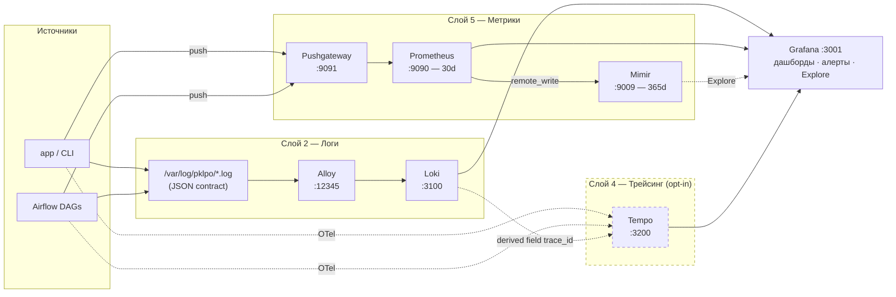
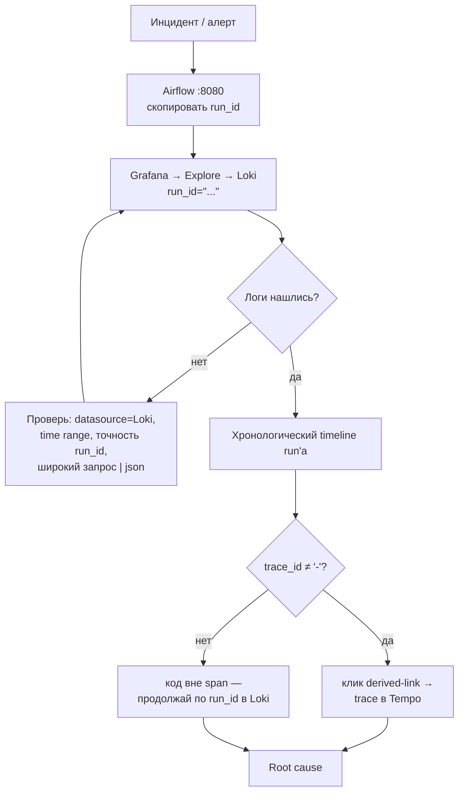
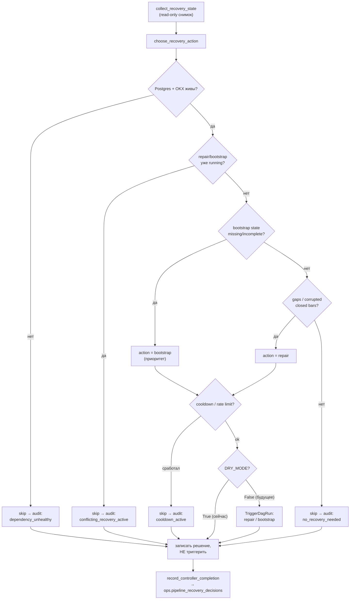

# PKLPO Observability & Reliability — Operator Guide

> **Единая точка входа** по всему стеку наблюдаемости и надёжности.
> Это карта: «что открыть, что сделать, куда нырять глубже».
> Детальные runbook'и: [`README.md`](README.md) (метрики/дашборды),
> [`LOGS_RUNBOOK.md`](LOGS_RUNBOOK.md) (логи/LogQL).

Стек собран в треке `observability-reliability-track` (OB1→OB4 + Grafana LGTM).
Главный принцип: **`run_id` — первичный ключ любого расследования**. Trace, метрики
и дашборды — это дополнения поверх `run_id`, а не замена.

---

## 1. Архитектура: 5 слоёв

| Слой | Технологии | Что даёт |
|------|-----------|----------|
| **1. Log contract** | `src/logging/` (JSON) | Единый формат: `run_id, symbol, timeframe, component, error_type, trace_id, span_id` |
| **2. Логи** | Loki + **Alloy** + Grafana | Поиск логов без `grep` на сервере |
| **3. Координация** | Redis | Distributed locks (fail-closed) + cache (fail-open) |
| **4. Трейсинг + долгие метрики** | **Tempo** + OpenTelemetry, **Mimir** (365 дней) | Distributed tracing + долгое хранение метрик |
| **5. Метрики + надёжность** | Prometheus + Pushgateway, дашборды, алерты, `pipeline_recovery_controller` | Метрики пайплайна + авто-восстановление |

> Поток логов: `app/Airflow → JSON в /var/log/pklpo/*.log → Alloy → Loki → Grafana`.
> Поток метрик: `job → Pushgateway → Prometheus → (remote_write) → Mimir`.
> Поток трейсов: `app (OTel) → Tempo` (включается опционально, см. §6).



> Пунктир = опциональные/lazy пути: трейсинг выключен по умолчанию (§6),
> Mimir используется только через Explore, `trace_id` связывает лог с трейсом.

---

## 2. Точки доступа

| Сервис | URL | Логин | Зачем |
|--------|-----|-------|-------|
| **Grafana** | http://localhost:3001 | `admin` / `admin` | Главный экран: дашборды, алерты, логи, трейсы |
| Prometheus | http://localhost:9090 | — | Сырые метрики (хранение 30 дней) |
| Pushgateway | http://localhost:9091 | — | Проверить, что job отправил метрику |
| Loki | :3100 | — | Хранилище логов (бэкенд, обычно через Grafana) |
| Tempo | :3200 | — | Хранилище трейсов (бэкенд, обычно через Grafana) |
| Mimir | :9009 | — | Долгие метрики 365 дней (только через Grafana Explore) |
| Alloy | http://localhost:12345 | — | UI коллектора логов: диагностика scrape |
| Airflow | http://localhost:8080 | `admin` / `admin` | DAG runs, отсюда берём `run_id` |

> Если UI не открывается — **не меняй код**. Сначала проверь, что соответствующий
> стек запущен (см. §3).

---

## 3. Запуск стека

```bash
# Весь мониторинг (Loki, Alloy, Prometheus, Pushgateway, Tempo, Mimir, Grafana)
docker compose -f ops/monitoring/docker-compose.monitoring.yml up -d

# При первом запуске после миграции Promtail→Alloy убрать orphan-контейнер:
docker compose -f ops/monitoring/docker-compose.monitoring.yml up -d --remove-orphans

# Только логи (минимум для разбора инцидента)
docker compose -f ops/monitoring/docker-compose.monitoring.yml up -d loki alloy grafana
```

Grafana provisioning (datasources, дашборды, алерты) поднимается автоматически
из `grafana/provisioning/` и `grafana/dashboards/`.

> Логи зависят от внешних volume'ов `pklpo-app-logs` и `pklpo-airflow-logs` —
> их создают app- и Airflow-стеки. Если Alloy не видит логов, эти стеки должны
> быть запущены первыми.

---

## 4. Дашборды Grafana

Открыть: Grafana → **Dashboards**.

| Дашборд | UID | Когда смотреть |
|---------|-----|----------------|
| **PKLPO Pipeline Observability v1** | `pklpo-pipeline-obs-v1` | Главный ежедневный экран |
| **PKLPO Data Quality** | `pklpo-data-quality` | Когда главный показал проблему freshness / hole rate / качества |
| **PKLPO Instrument Onboarding** | `pklpo-instrument-onboarding` | Прогресс bootstrap/warm-up новых инструментов |
| **PKLPO Instrument Drilldown** | `pklpo-instrument-drilldown` | Детализация по конкретному `symbol`/`timeframe` |

> Все дашборды работают на datasource UID `Prometheus` (по ADR — без изменений).
> Mimir доступен **только в Explore** для запросов глубже 30 дней.

---

## Сценарий A — Ежедневный health-check

1. Grafana → **PKLPO Pipeline Observability v1**.
2. Проверь верхние панели:
   - свежесть свечей (нет ли большого lag);
   - есть ли failed/blocked состояния;
   - `pklpo_dependency_postgres_up` и `pklpo_dependency_okx_up` равны `1`;
   - нет ли critical/warning alerts.
3. Если видишь проблему — возьми `run_id` из Airflow и переходи к Сценарию B.

**Норма:** дашборд открывается, панели не пустые, обе зависимости `= 1`, critical
alerts отсутствуют. Пустой дашборд после успешного DAG run — **не норма** (см. §8).

---

## Сценарий B — Разбор инцидента: `run_id → trace_id → Tempo`

Это **главный flow** расследования. `run_id` первичен всегда.

1. Airflow (http://localhost:8080) → нужный DAG run → скопировать `run_id`.
2. Grafana → **Explore** → datasource **Loki** → запрос:
   ```logql
   {job=~"pklpo_app|pklpo_airflow"} | json | run_id="<RUN_ID>"
   ```
3. Получаешь полный хронологический timeline run'а.
4. Если в строке лога `trace_id` **не равен** `"-"`:
   - кликни derived-link `trace_id` → Grafana откроет соответствующий trace в **Tempo**.
   - Если `trace_id == "-"` — этот код выполнялся вне активного span, продолжай по `run_id`.

**Полезные срезы Loki** (полностью — в [`LOGS_RUNBOOK.md`](LOGS_RUNBOOK.md)):
```logql
{job=~"pklpo_app|pklpo_airflow", symbol="BTC-USDT-SWAP", level="ERROR"}
{job=~"pklpo_app|pklpo_airflow", error_type="lock_conflict"}
{job=~"pklpo_app|pklpo_airflow", component="swap_repair", level="ERROR"}
```
Компоненты: `swap_sync, swap_repair, features, market_selection, pipeline`.
Типы ошибок: `db_error, api_error, timeout_error, rate_limit_error,
validation_error, eligibility_error, data_quality_error, permission_error,
lock_conflict, unexpected_error`.



---

## Сценарий C — Проверка метрик

**Текущие метрики (≤ 30 дней)** → Prometheus (http://localhost:9090) → Execute:
```promql
pklpo_pipeline_candle_lag_seconds
pklpo_pipeline_recalc_queue_rows
pklpo_pipeline_alerts
pklpo_dependency_postgres_up
pklpo_dependency_okx_up
pklpo_feature_warmup_bars_remaining     # прогресс warm-up новых инструментов
```

**Долгие метрики (> 30 дней)** → Grafana → **Explore** → datasource **Mimir**.
Те же `pklpo_*` метрики, хранение 365 дней.

**Цепочка диагностики метрики:**
- метрики нет в Prometheus → проверь Pushgateway (http://localhost:9091);
- есть в Pushgateway, нет в Prometheus → проблема scrape/конфигурации;
- нет нигде → job/DAG не запускался или не смог отправить — смотри логи по `run_id`.

---

## Сценарий D — Включить distributed tracing

Tracing **по умолчанию выключен** (opt-in). Включается через env:

```bash
OBSERVABILITY_OTEL_ENABLED=true
OBSERVABILITY_OTEL_SERVICE_NAME=pklpo
OBSERVABILITY_OTEL_EXPORTER_OTLP_ENDPOINT=http://tempo:4318   # OTLP HTTP
OBSERVABILITY_OTEL_SAMPLE_RATIO=1.0                            # в dev полный сэмплинг
```

> В проде **понизить** `OBSERVABILITY_OTEL_SAMPLE_RATIO` после замера объёма трейсов.
> Airflow-runtime требует пересборки/refresh образа, чтобы подхватить OTel-пакеты
> из `ops/airflow/requirements-airflow.txt`. Проверка:
> ```bash
> docker exec pklpo-airflow-airflow-scheduler-1 \
>   python -c "from src.pklpo_platform import observability; print(observability.get_trace_ids())"
> # ожидается ('-', '-') при выключенном tracing
> ```

После включения spans несут атрибуты: `run_id, component, symbol, timeframe`,
а также `status, duration_seconds, processed_count` и `error_type` на ошибках.
Сейчас инструментирован один путь — `pipeline_monitoring`.

---

## Сценарий E — Redis locks и cache

- **Locks (fail-closed):** `swap-repair` и `swap-sync` берут `job_lock` до тяжёлой
  работы. Параллельный запуск того же logical job блокируется и логируется с
  `error_type=lock_conflict`. Если Redis недоступен — mutation-пути **падают**
  (fail-closed, это by design).
- **Cache (fail-open):** read-through кэш для exchange metadata, instrument list,
  last ingested timestamps. Если Redis недоступен — запрос идёт в source of truth
  без падения; корректность не зависит от Redis.
- Настройки — в `.env` (`REDIS_URL`, `REDIS_LOCK_TIMEOUT_SECONDS`, TTL'ы).

---

## Сценарий F — Pipeline Recovery Controller

DAG `pipeline_recovery_controller` (расписание `*/30 * * * *`) наблюдает состояние
пайплайна и записывает решение в `ops.pipeline_recovery_decisions`.

> ⚠️ **Сейчас `DRY_MODE = True`** (`ops/airflow/dags/pipeline_recovery_controller.py`).
> Контроллер **только пишет решения, ничего не триггерит**. Это безопасный режим
> для накопления аудита.



**Что делает оператор сейчас:** периодически сверяй строки решений с ожиданиями:
```sql
SELECT created_at, decision_status, action_kind, reason, symbol, timeframe
FROM ops.pipeline_recovery_decisions ORDER BY created_at DESC LIMIT 50;
```

**Поэтапное включение** (только после анализа аудита, чтобы не словить циклы):
1. Несколько дней наблюдать решения в DRY-режиме.
2. Включить `controller-last-closed-bars` (самый безопасный repair).
3. Затем `controller-gap-repair`, если аудит не показал петель.
4. В последнюю очередь — bounded bootstrap (только для явно incomplete state).

Полный контракт триггеров и safety-правила — в дизайн-доке трека
(`Captains_Logbook/planning/observability-reliability-track/2026-06-16__pipeline-recovery-controller-design.md`).

---

## 5. Алерты

| Alert | Что значит | Первое действие |
|-------|------------|-----------------|
| Freshness lag | Свечи давно не обновлялись | Sync DAG + логи по `run_id` |
| Hole rate high | Пропуски в данных | Repair DAG + Data Quality dashboard |
| Recalc queue high | Очередь пересчёта растёт | feature/recalc DAG runs |
| Postgres down | База недоступна | Сначала база, downstream alerts потом |
| OKX down | OKX API недоступен | Зависимые sync runs |
| Swap sync errors | Ошибки синхронизации | `run_id` в Loki |
| Pushgateway stale | Job перестал слать метрики | Проверь, запускается ли DAG |
| Bootstrap/warm-up stalled | Новый инструмент завис на onboarding | Instrument Onboarding dashboard |

`warning` — система работает, но проблема видна. `critical` — пайплайн может выдавать
некорректный результат. При одновременном root-cause (`postgres_down`/`okx_down`)
и downstream-алертах — **сначала root cause**.

---

## 6. Troubleshooting

**Дашборд открылся, но панели пустые**
1. Проверь time range (поставь последние 1–6 часов).
2. Запускался ли `pipeline_monitoring` в Airflow.
3. Проверь метрики в Pushgateway. Нет — проблема на стороне job/runtime.

**Логи по `run_id` не находятся**
1. Datasource = **Loki**, проверь time range и точность `run_id`.
2. Попробуй широкий запрос `{job=~"pklpo_app|pklpo_airflow"} | json`.
3. Если общий запрос возвращает логи, а по `run_id` нет — проблема в log context.

**Loki пустой**
- `docker logs pklpo-alloy` — ошибки scrape;
- `docker logs pklpo-loki` — ошибки ingestion;
- Alloy UI http://localhost:12345 → Components → `loki.source.file.*`;
- проверь, что app/Airflow-стеки пишут в `/var/log/pklpo/*.log`.

**Mimir `/ready` не отвечает / нет метрик**
- `remote_write` идёт с лагом ~30s после старта Prometheus;
- проверка: `bash scripts/validate_lgtm_acceptance.sh --skip-v1 --require-mimir-metric`.

---

## 7. Инварианты — что нельзя нарушать

- ❌ `run_id`, `trace_id`, `span_id` **никогда** не становятся Loki/Prometheus
  labels (в Loki — только structured metadata). Контролируется acceptance-чеком.
  Допустимые low-cardinality labels: `level, component, symbol, timeframe, error_type`.
- ✅ OTel SDK импортируется **только** через `src/logging/tracing.py`. Facade
  `src/pklpo_platform/observability/` — re-export, side-effect-free.
- ✅ `src/logging/` — canonical logging surface (не дублировать в `src/platform/`).
- ✅ Tracing disabled by default; включается только через env.
- ✅ Все образы pinned: Tempo 2.4.1, Mimir 3.1.1, Alloy v1.8.3, Loki 3.0.0.
- ❌ Не искать `run_id` в Prometheus labels — он только в логах.
- ❌ Не закрывать critical alert без проверки `run_id`.

---

## 8. Acceptance / проверка стека

```bash
# v1 (Prometheus + Loki + Grafana)
bash scripts/validate_v1_acceptance.sh           # или .ps1 на Windows

# LGTM (Tempo + Mimir + Alloy), пропустить v1-часть:
bash scripts/validate_lgtm_acceptance.sh --skip-v1
bash scripts/validate_lgtm_acceptance.sh --skip-v1 --require-mimir-metric  # с проверкой ingestion

# Alloy runtime parity (требует DAG run через Alloy)
bash scripts/validate_r3_acceptance.sh
```

> На Windows без WSL-дистрибутива используй `.ps1`-варианты acceptance-скриптов.

---

## 9. Куда смотреть глубже

| Тема | Документ |
|------|----------|
| Метрики, дашборды, Pushgateway | [`README.md`](README.md) |
| Логи, LogQL, Alloy | [`LOGS_RUNBOOK.md`](LOGS_RUNBOOK.md) |
| История трека, решения, acceptance-proof'ы | `Captains_Logbook/planning/observability-reliability-track/` |
| LGTM-интеграция (Tempo/Mimir/Alloy) | `.../2026-06-20__lgtm-execution-report.md` |
| Recovery controller (контракт, safety) | `.../2026-06-16__pipeline-recovery-controller-design.md` |
| ADR: стратегия datasource (Prometheus vs Mimir) | `Captains_Logbook/done/2026/06/adr/ADR-2026-06-20-mimir-dashboard-datasource-strategy.md` |
