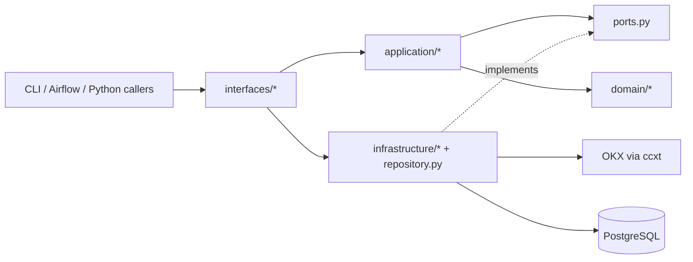
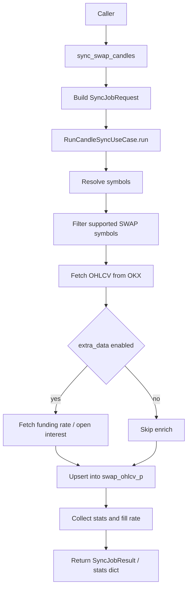
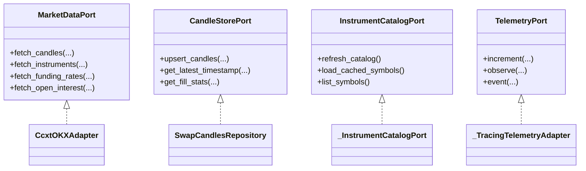
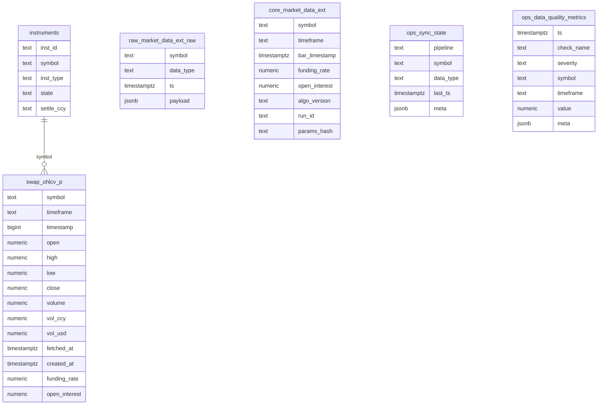

# Candles Module

`src/candles` это канонический модуль синхронизации и обслуживания OKX swap OHLCV-данных в проекте.

Основной сценарий модуля:

- загрузка свечей `SWAP` инструментов OKX;
- инкрементальная запись в `swap_ohlcv_p`;
- опциональное обогащение строк `funding_rate` и `open_interest`;
- обновление каталога инструментов;
- выдача единого runtime API для CLI, Airflow и Python-вызовов;
- сбор run-scoped telemetry, статистики записи и quality-метрик.

Legacy runtime-пути для sync здесь не поддерживаются. Единственный поддерживаемый market adapter для основного sync path: `ccxt`.

## Что находится в модуле

```text
src/candles/
├── application/      # orchestration, use cases, quality pipeline, metadata API
├── domain/           # типы, политики, конфиг, timeframes, инварианты
├── infrastructure/   # адаптеры OKX/DB/config/logging/quality/raw/core helpers
├── interfaces/       # внешние entrypoints для Python/CLI/Airflow
├── migrations/       # SQL-миграции схем market_meta/raw/core/ops
├── observability/    # tracing, metrics, prometheus helpers
├── ports.py          # Protocol-контракты слоя приложения
├── repository.py     # репозиторий записи/чтения свечей
├── load_instruments.py
├── instruments_service.py
└── api.py            # compatibility surface для market metadata
```

## Ключевые entrypoints

Основные точки входа:

- Python sync: `src.candles.interfaces.swap_sync.sync_swap_candles`
- Python catalog refresh: `src.candles.interfaces.swap_sync.run_catalog_refresh_via_application`
- Airflow sync: `src.candles.interfaces.airflow_sync.run_swap_sync`
- Airflow refresh: `src.candles.interfaces.airflow_sync.run_catalog_refresh_job`
- CLI проекта: `python -m src.cli.main swap-sync`
- Standalone helper: `python -m src.candles.interfaces.cli`
- Инструменты каталога: `python -m src.candles.load_instruments`, `python -m src.candles.update_instruments_list`

## Зависимости

Ключевые runtime-зависимости по `pyproject.toml`:

- `ccxt` для доступа к OKX;
- `aiohttp` как HTTP dependency graph для async-стека;
- `asyncpg` для PostgreSQL driver layer;
- `sqlalchemy` для DB access;
- `pydantic` и `pydantic-settings` для typed config;
- `prometheus-client` для observability;
- `aiolimiter` используется в `ccxt_okx_adapter.py` для rate limiting.

Внутренние зависимости модуля:

- `src.utils.session_utils.get_db_session` для async DB session;
- `src.utils.retry.get_db_retry` для retry при transient DB errors;
- `src.models.Instrument` для работы с таблицей инструментов;
- `src.logging` для общего логирования проекта.

## Архитектура

Модуль построен вокруг разделения `interfaces -> application -> domain -> infrastructure`.

### Слои

- `interfaces`
  Внешние адаптеры. Принимают вход от CLI/Airflow/Python и собирают зависимости.
- `application`
  Use cases и orchestration. Здесь живёт сценарий sync run, refresh каталога, quality pipeline.
- `domain`
  Чистые модели и политики: `SyncConfig`, `ExecutionMode`, `TF_TO_MS`, retry/batch policies, metadata/value objects.
- `infrastructure`
  Реализация интеграций: `CcxtOKXAdapter`, DB repository, config/logging/metrics helpers.
- `observability`
  Trace context, correlation id, bounded metrics sampling, Prometheus helpers.

### Схема слоёв



## Основной sync pipeline

Главная orchestration-точка: `application/sync/use_cases.py`.

Поток выполнения:

1. создаётся `SyncJobRequest`;
2. `interfaces/swap_sync.py` собирает адаптер рынка, репозиторий и telemetry adapter;
3. `RunCandleSyncUseCase.run()` проверяет доступность БД;
4. определяется набор символов:
   `request.symbols` -> refresh каталога -> cache file -> symbols из БД;
5. список фильтруется по фактически поддерживаемым SWAP инструментам OKX;
6. по каждому символу и timeframe вызывается fetch свечей;
7. выполняется инкрементальная фильтрация по `latest_stored_ts`;
8. при `extra_data=True` подгружаются funding rate и open interest;
9. батч upsert-ится в `swap_ohlcv_p`;
10. собираются endpoint stats, fill rate, db write metrics и run result.

### Data flow



### Конкурентность

- параллельность по символам контролируется `asyncio.TaskGroup`;
- лимит задаётся `SyncJobRequest.max_concurrent_symbols`;
- внутри `CcxtOKXAdapter` дополнительно работают:
  `AsyncLimiter` на глобальный поток, свечи, extra-data и per-instrument rate limit.

### Retry и fail-fast

- retry fetch-операций задаётся `RetryPolicy`;
- retriable ошибки определяются по сообщению/статусу;
- DB outage распознаётся отдельно через `_is_db_outage_error(...)`;
- при недоступности БД sync abort-ится целиком с `DatabaseUnavailableError`.

## Публичные интерфейсы

### Python sync API

```python
from src.candles.interfaces.swap_sync import sync_swap_candles

stats = await sync_swap_candles(
    symbols=["BTC-USDT-SWAP"],
    timeframes=["1m", "5m"],
    config={
        "mode": "fast",
        "extra_data": False,
        "batch_size": 300,
        "max_concurrent_symbols": 3,
    },
)
```

Возвращаемый dict содержит:

- `total_symbols`
- `total_candles_synced`
- `total_symbols_processed`
- `errors_count`
- `duration_seconds`
- `symbols_per_second`
- `candles_per_second`
- `results_by_symbol`
- `endpoint_stats`
- `today_fill`
- `db_write`
- `sync_run`

### Airflow interface

`src.candles.interfaces.airflow_sync` предоставляет:

- `run_catalog_refresh_job(request)`
- `run_refresh_okx_meta(request)`
- `run_swap_sync(request)`
- `run_smoke_validate(request)`

`AirflowSyncRequest` содержит:

- `conf`
- `logical_date`
- `run_type`
- `is_manual`

Airflow-слой дополнительно делает:

- mode resolution;
- freshness gate перед sync;
- преобразование статистики в компактный XCom payload с обязательным `total_symbols_processed`.
- policy validation в DAG: non-skipped run считается total failure только при `rows_upserted_total == 0` или `total_symbols_processed == 0`.

### Standalone CLI

`src.candles.interfaces.cli` поддерживает команды:

- `sync`
- `status`
- `details`
- `cleanup`
- `export`

Это не основной CLI проекта, а отдельный служебный интерфейс для диагностики и локальной работы с `swap_ohlcv_p`.

## Контракты и порты

Главные Protocol-контракты объявлены в `src/candles/ports.py`.

### `MarketDataPort`

Отвечает за внешние market data вызовы:

- `fetch_candles(...)`
- `fetch_instruments(...)`
- `fetch_funding_rates(...)`
- `fetch_open_interest(...)`

### `CandleStorePort`

Контракт хранилища свечей:

- `upsert_candles(...)`
- `get_latest_timestamp(...)`
- `get_fill_stats(...)`

### `InstrumentCatalogPort`

Контракт каталога инструментов:

- `refresh_catalog()`
- `load_cached_symbols()`
- `list_symbols()`

### `SyncStatePort`

Контракт freshness/watermark слоя:

- `is_data_fresh(...)`

### `TelemetryPort`

Контракт observability:

- `increment(...)`
- `observe(...)`
- `event(...)`

### Схема интерфейсов



## Конфигурация

Typed config живёт в `src.candles.domain.sync_config.SyncConfig`.

Поддерживаемые поля:

- `max_requests_per_second`
- `batch_size`
- `max_retries`
- `retry_delay`
- `max_concurrent_symbols`
- `extra_data`
- `use_ccxt`
- `dynamic_batch_size`

Поддерживаемые env vars:

- `CANDLES_MAX_RPS`
- `CANDLES_BATCH_SIZE`
- `CANDLES_MAX_RETRIES`
- `CANDLES_RETRY_DELAY`
- `CANDLES_MAX_CONCURRENT`
- `CANDLES_EXTRA_DATA`
- `CANDLES_USE_CCXT`
- `CANDLES_DYNAMIC_BATCH`
- `CANDLES_ADAPTER`
- `INSTRUMENTS_CACHE_DIR`

`build_market_data_adapter(...)` поддерживает только `adapter=ccxt`. Любое другое значение приводит к `RuntimeError`.

## Режимы синхронизации

Mode presets задаются в `application/sync_use_cases.py`.

| Mode | Timeframes | Extra data | Max concurrent | Max RPS | Назначение |
|---|---|---:|---:|---:|---|
| `fast` | `1m`, `5m` | `false` | `10` | `20` | частая синхронизация коротких ТФ |
| `slow` | `15m`, `30m`, `1H`, `4H`, `12H`, `1D`, `1W`, `1M` | `false` | `2` | `15` | дозагрузка старших ТФ |
| `ext` | `1m`, `5m` | `true` | `5` | `15` | sync с funding/open interest |
| `bootstrap` | default timeframes | `true` | `1` | `15` | первичная загрузка/полная инициализация |

Если Airflow run scheduled и `conf.mode` не задан:

- на `:00`, `:15`, `:30`, `:45` выбирается `slow`;
- иначе выбирается `fast`.

## Источники данных и адаптеры

### `CcxtOKXAdapter`

Реализует:

- `get_candles(...)`
- `get_instruments(...)`
- `get_funding_rates(...)`
- `get_open_interest(...)`

Особенности:

- формат инструмента `BASE-QUOTE-SWAP` конвертируется в ccxt symbol вида `BTC/USDT:USDT`;
- свечи нормализуются в dict с полями
  `ts`, `open`, `high`, `low`, `close`, `volume`, `volCcy`, `volUsd`;
- funding/open interest забираются отдельными вызовами;
- адаптер сам ограничивает скорость запросов.

## Хранилище и схема данных

### Основная таблица sync path

`SwapCandlesRepository` пишет в `swap_ohlcv_p` через `INSERT ... ON CONFLICT`.

Фактически upsert-ятся поля:

- `symbol`
- `timeframe`
- `timestamp`
- `open`
- `high`
- `low`
- `close`
- `volume`
- `vol_ccy`
- `vol_usd`
- `fetched_at`
- `funding_rate`
- `open_interest`

Конфликтный ключ:

- `(symbol, timeframe, timestamp)`

### Каталог инструментов

`load_instruments.py` загружает OKX инструменты в таблицу `instruments`:

- добавляет/обновляет `SWAP` инструменты;
- извлекает `base_ccy` и `quote_ccy`;
- помечает отсутствующие в новом snapshot инструменты как `expired`.

`instruments_service.py` поддерживает cache file `instruments_list.json` и держит приоритетный порядок:

- `BTC-USDT-SWAP`
- `ETH-USDT-SWAP`
- остальные символы по алфавиту.

### Сопутствующие схемы из миграций

Миграции в `src/candles/migrations` описывают более широкий data platform контур:

- `001_create_market_meta_tables.sql`
  таблицы `market_meta`, `validation_cache`, `risk_limits`, `validation_log`;
- `002_raw_core_schemas.sql`
  схемы `raw`, `core`, `ops` и таблицы:
  `raw.market_data_ext_raw`, `core.market_data_ext`, `ops.sync_state`;
- `003_sync_state_meta.sql`
  расширение `ops.sync_state.meta` и check по `data_type`;
- `004_data_quality_metrics.sql`
  таблица `ops.data_quality_metrics`;
- `005_performance_indexes.sql`
  индексы для `raw.market_data_ext_raw` и `core.market_data_ext`;
- `006_metadata_not_null.sql`
  обязательность `algo_version`, `run_id`, `params_hash` в `core.market_data_ext`.

### Схема данных



## Observability

### Runtime telemetry

Во время sync run через `TelemetryPort.event(...)` используются события:

- `sync_started`
- `symbol_started`
- `fetch_retried`
- `upsert_failed`
- `symbol_completed`
- `sync_completed`

### Correlation tracing

`observability/tracer.py` даёт:

- `correlation_id` на run scope;
- `trace_context` через `contextvars`;
- `CorrelationLogFilter` для логов;
- `trace_event(...)` для структурированных событий.

### Performance metrics

`observability/metrics.py` использует bounded reservoir sampling:

- среднее и percentiles без неограниченного роста памяти;
- счётчики `fetch.*`, `upsert.*` и произвольные counters;
- сводка по latency и batch size.

### Quality metrics

`application/quality_pipeline.py` и `application/quality_checks.py` работают с quality pipeline и `ops.data_quality_metrics`.

## Freshness, quality и smoke-проверки

Airflow/use case слой поддерживает:

- freshness gate перед sync;
- smoke validation после sync;
- расчёт lag по timeframe;
- fill-rate контроль по `funding_rate` и `open_interest`.

Правила freshness:

- для `fast` проверяется `1m`, lag threshold `120s`;
- для остальных режимов проверяется `15m`, lag threshold `900s`.

Если данные свежие, sync может быть пропущен.

## Compatibility surface для market metadata

`src.candles.api` и `src.candles.application.api` содержат compatibility API вокруг market metadata:

- `refresh_okx_meta`
- `refresh_okx_meta_extended`
- `get_instrument_info`
- `get_funding_rate`
- `get_open_interest`
- `validate_order`
- `calculate_notional_value`

Это соседний контур внутри того же пакета, но не основной sync runtime свечей.

## Что важно помнить при изменениях

- для runtime sync используйте `interfaces/swap_sync.py` как канонический entrypoint;
- не добавляйте новые legacy alias-модули для sync;
- если меняется контракт синхронизации, обновляйте `ports.py`, `application/sync/*` и интерфейсные адаптеры согласованно;
- если меняется схема хранилища, проверяйте `repository.py`, SQL-миграции и Airflow smoke/freshness path;
- при изменении списка timeframes синхронизируйте `domain/timeframes.py`, `MODE_CONFIGS` и документацию.

## Полезные команды

Из текущего дерева подтверждены:

- `python -m src.cli.main swap-sync --symbols BTC-USDT-SWAP --timeframes 1m 5m 15m`
- `python -m src.cli.main update-list`
- `python -m src.cli.main migrate`
- `pytest -m "not slow and not integration"`
- `ruff check src tests`

Для локальной проверки самого модуля полезны также:

- `pytest tests/candles`
- `python -m src.candles.load_instruments`
- `python -m src.candles.update_instruments_list`

## Тестовое покрытие

По дереву `tests/candles/` есть проверки на:

- adapter factory;
- config validation;
- repository contract;
- Airflow interface;
- concurrency;
- retry/rate limit;
- DB reconnect/fail-fast paths;
- observability contract;
- import/architecture boundaries.

Это хороший ориентир, если вы меняете публичный runtime contract.
