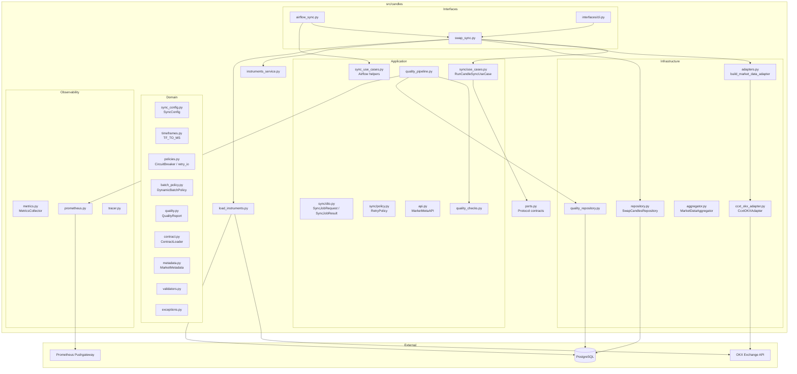
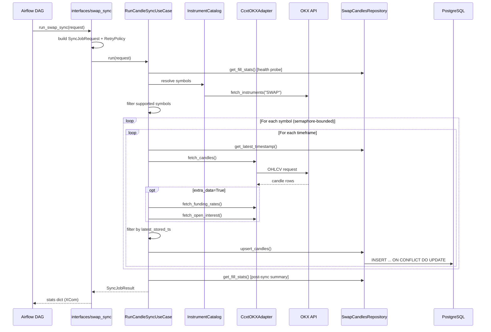
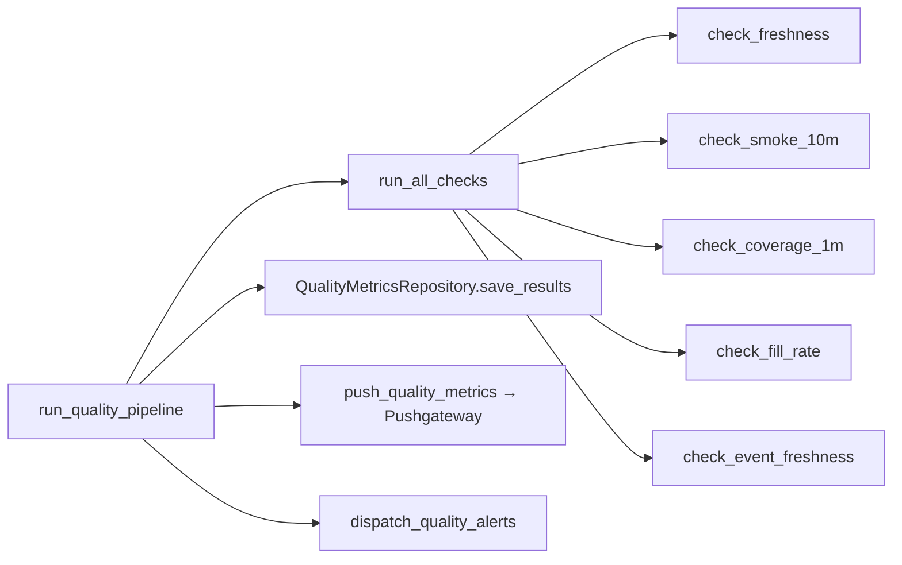

# Candles Module

## Purpose

`src/candles` is the OHLCV data ingestion bounded context. It synchronizes swap candle data from OKX into PostgreSQL (`swap_ohlcv_p`), manages the instrument catalog, provides market metadata, runs data quality checks, and exposes telemetry.

### Responsibility boundary

This module owns:

- Fetching OHLCV candles, funding rates, and open interest from OKX
- Upserting normalized candle rows into `swap_ohlcv_p` (partitioned table)
- Instrument catalog lifecycle (load from exchange, cache to file, store in `instruments` table)
- Market metadata API (instrument info, order validation, risk limits)
- Data quality pipeline (freshness, coverage, fill-rate, smoke checks)
- Extended data aggregation (1m → 5m/15m/1H) governed by `contracts/market_data_ext_contract.md`

This module does **not** own:

- Feature calculation (→ `src/features`)
- Trading execution or order placement
- Database schema migrations beyond its own `migrations/` directory

## Architecture



## Data flow



## Key entrypoints

| Caller | Entrypoint | Purpose |
|--------|-----------|---------|
| Airflow DAG | `interfaces.airflow_sync.run_swap_sync` | Main scheduled sync |
| Airflow DAG | `interfaces.airflow_sync.run_catalog_refresh_job` | Refresh instrument catalog |
| Airflow DAG | `interfaces.airflow_sync.run_smoke_validate` | Post-sync smoke test |
| Project CLI | `python -m src.cli.main swap-sync` | Manual sync trigger |
| Project CLI | `python -m src.cli.main swap-repair` | Historical backfill / gap repair with detect-only, dry-run, apply |
| Project CLI | `python -m src.cli.main update-list` | Update instruments list |
| Diagnostic CLI | `python -m src.candles.interfaces.cli` | Status, details, export, cleanup |
| Python API | `src.candles.api.refresh_okx_meta` | Refresh market metadata cache |
| Python API | `src.candles.api.validate_order` | Pre-trade order validation |

## Internal structure

```text
src/candles/
├── application/
│   ├── metadata/              # Market metadata use cases and DTOs
│   ├── repair/                # Historical backfill / gap repair use cases and DTOs
│   ├── sync/                  # Core sync use case, DTOs, retry policy, ports
│   ├── api.py                 # MarketMetaAPI facade (metadata, validation, risk)
│   ├── quality_checks.py      # Individual quality checks (freshness, coverage, fill-rate)
│   ├── quality_pipeline.py    # Orchestrates checks → persist → alert
│   └── sync_use_cases.py      # Airflow-specific helpers (mode, freshness gate, XCom)
├── cli/                       # Standalone CLI for market metadata ops
├── contracts/                 # market_data_ext_contract.md — normalization/aggregation rules
├── domain/
│   ├── batch_policy.py        # DynamicBatchPolicy (latency/CPU-adaptive batch sizing)
│   ├── contract.py            # ContractLoader — parses contract, computes params_hash
│   ├── exceptions.py          # Exception hierarchy (MarketMetaError → OKX/Risk/Validation)
│   ├── metadata.py            # MarketMetadata, InstrumentMetadata, FundingRate models
│   ├── policies.py            # CircuitBreaker + retry_io async wrapper
│   ├── quality.py             # Severity, Thresholds, CheckResult, QualityReport
│   ├── risk_limits.py         # RiskLimits, PositionLimits
│   ├── sync_config.py         # SyncConfig (Pydantic, env-aware)
│   ├── timeframes.py          # TF_TO_MS / TF_TO_SEC constants
│   └── validators.py          # MarketValidator, PositionValidator
├── infrastructure/
│   ├── adapters.py            # Factory: build_market_data_adapter → CcxtOKXAdapter
│   ├── aggregator.py          # 1m→{5m,15m,1H} extended data aggregation
│   ├── normalizer.py          # Raw data normalization (LKV for funding/OI/L2)
│   ├── ohlcv_aligner.py       # Aligns extended data to actual OHLCV bar timestamps
│   ├── quality_repository.py  # Persists quality check results
│   ├── raw_ingest.py          # Extended market data raw ingestion
│   ├── okx_integration.py     # OKXMetadataLoader (instruments, funding, tickers, OI)
│   └── ...                    # config, logging, metrics, reprocess, retention, etc.
├── interfaces/
│   ├── airflow_sync.py        # Airflow task functions (catalog refresh, sync, validate)
│   ├── cli.py                 # Standalone diagnostic CLI (status, details, export, cleanup)
│   ├── repair.py              # Wires repair/backfill use cases to OKX + DB adapters
│   └── swap_sync.py           # Wires application layer to infra adapters
├── migrations/                # SQL: 001..006 (tables, indexes, data quality metrics)
├── observability/
│   ├── metrics.py             # ReservoirSampling, MetricsCollector
│   ├── prometheus.py          # Push quality metrics to Pushgateway
│   ├── structlog_config.py    # Structlog configuration
│   └── tracer.py              # Event tracing
├── api.py                     # Re-export facade for metadata functions
├── ccxt_okx_adapter.py        # CcxtOKXAdapter: CCXT-backed OKX market data adapter
├── instruments_service.py     # instruments_list.json cache management
├── load_instruments.py        # Loads SWAP instruments into `instruments` table
├── ports.py                   # Protocol contracts (MarketDataPort, CandleStorePort, etc.)
├── repository.py              # SwapCandlesRepository (upsert, latest_ts, fill_stats)
└── update_instruments_list.py # Updates instruments_list.json from DB
```

## Core concepts

### Sync modes

Defined in `application/sync/dto.py:ExecutionMode`:

| Mode | Usage |
|------|-------|
| `fast` | Default. Syncs latest data for all timeframes |
| `slow` | Larger backfill, runs at 15-min slots |
| `ext` | Extended data (funding + OI enrichment) |
| `bootstrap` | Full historical load |

### Timeframes

Defined in `domain/timeframes.py`. All 10 supported OKX swap bars:

`1m`, `5m`, `15m`, `30m`, `1H`, `4H`, `12H`, `1D`, `1W`, `1M`

### Upsert semantics

`repository.py` uses `INSERT ... ON CONFLICT (symbol, timeframe, timestamp) DO UPDATE`. All columns are overwritten on conflict — the contract does not currently implement `COALESCE` protection for non-null fields (despite the domain contract specifying `DO_NOT_OVERWRITE_NON_NULL_WITH_NULL`).

### Rate limiting

`CcxtOKXAdapter` enforces multi-level `AsyncLimiter` shaping:

- Global: 80 req/s (configurable)
- Candles: 16 req/s
- Extra data (funding/OI): 3 req/s
- Per-instrument: 27 req/s (candles), 2 req/s (funding)

### Reliability

- **Retry**: `RetryPolicy` with exponential backoff + jitter (configurable max_retries, delay)
- **Circuit breaker**: `CircuitBreaker` in `domain/policies.py` (Closed → Open → HalfOpen)
- **DB retry**: `repository.py` wraps operations with `get_db_retry()` for transient connection errors
- **Database unavailable**: `DatabaseUnavailableError` aborts the entire sync run if DB is unreachable

## Configuration

`SyncConfig` (`domain/sync_config.py`) — Pydantic model, loads from env vars:

| Env var | Field | Default | Range |
|---------|-------|---------|-------|
| `CANDLES_MAX_RPS` | max_requests_per_second | 80 | 1–200 |
| `CANDLES_BATCH_SIZE` | batch_size | 300 | 50–1000 |
| `CANDLES_MAX_RETRIES` | max_retries | 3 | 0–10 |
| `CANDLES_RETRY_DELAY` | retry_delay | 1.0 | 0.1–30.0 |
| `CANDLES_MAX_CONCURRENT` | max_concurrent_symbols | 3 | 1–50 |
| `CANDLES_EXTRA_DATA` | extra_data | false | — |
| `CANDLES_USE_CCXT` | use_ccxt | true | — |
| `CANDLES_DYNAMIC_BATCH` | dynamic_batch_size | false | — |
| `CANDLES_ADAPTER` | adapter selection | ccxt | only `ccxt` supported |

Observability env vars:

| Env var | Purpose |
|---------|---------|
| `OBSERVABILITY_PROMETHEUS_ENABLED` | Enable Prometheus push (`true`/`false`) |
| `OBSERVABILITY_PROMETHEUS_PUSHGATEWAY_URL` | Pushgateway URL |
| `OBSERVABILITY_JOB_NAME` | Job name for pushgateway (default: `data_quality_pipeline`) |
| `INSTRUMENTS_CACHE_DIR` | Runtime instruments cache directory (default: `/tmp/pklpo`) |

## Database tables

| Table | Purpose | Key columns |
|-------|---------|-------------|
| `swap_ohlcv_p` | Partitioned OHLCV storage | `(symbol, timeframe, timestamp)` PK |
| `instruments` | Instrument catalog | `symbol`, `inst_type`, `settle_ccy`, `state` |

The `swap_ohlcv_p` table stores: `symbol`, `timeframe`, `timestamp`, OHLCV fields, `vol_ccy`, `vol_usd`, `fetched_at`, `funding_rate`, `open_interest`.

## Quality pipeline



Quality thresholds (from `domain/quality.py`):

| Check | Warn | Critical | Direction |
|-------|------|----------|-----------|
| Freshness (min) | >5 | >15 | higher is worse |
| Coverage (%) | <90 | <70 | lower is worse |
| Smoke (count) | <9 | <8 | lower is worse |
| Duplicate rate | >0.01 | >0.1 | higher is worse |
| Funding fill (%) | <95 | <80 | lower is worse |
| OI fill (%) | <95 | <80 | lower is worse |

Severity levels: `ok=0`, `warn=1`, `critical=2` — pushed as Prometheus gauges.

## Airflow DAG

DAG `okx_swap_ohlcv_sync_v2` (`ops/airflow/dags/okx_swap_ohlcv_sync_v2.py`):

Schedule: `*/5 * * * *`

Tasks (sequential):
1. `refresh_okx_meta` → conditionally refreshes instrument catalog (skips if cache < 24h)
2. `swap_sync` → runs candle sync, checks freshness gate for scheduled runs
3. `smoke_validate` → post-sync smoke validation
4. `quality_pipeline` → full quality checks with alerts

DAG conf parameters: `mode`, `extra_data`, `timeframes`, `symbols`, `refresh_instruments`, `max_concurrent_symbols`.

## Commands

```bash
# Sync candles (project CLI)
python -m src.cli.main swap-sync --symbols BTC-USDT-SWAP --timeframes 1m 5m 15m

# Update instruments list
python -m src.cli.main update-list

# Load instruments into DB
python -m src.candles.load_instruments

# Diagnostic CLI
python -m src.candles.interfaces.cli status
python -m src.candles.interfaces.cli details BTC-USDT-SWAP
python -m src.candles.interfaces.cli export BTC-USDT-SWAP output.json --timeframes 1m 5m
python -m src.candles.interfaces.cli cleanup --days 30
python -m src.candles.interfaces.cli sync --symbols BTC-USDT-SWAP

# Run tests
pytest tests/candles/
pytest tests/candles/ -m "not slow and not integration"

# Lint
ruff check src/candles/
```

## Extending

### Adding a new market data adapter

1. Implement the `MarketDataPort` protocol from `ports.py` (or `application/sync/ports.py`)
2. Register it in `infrastructure/adapters.py:build_market_data_adapter`
3. Currently only `ccxt` is supported; the factory raises `RuntimeError` for unknown adapters

### Adding a new quality check

1. Add check function in `application/quality_checks.py`
2. Define thresholds in `domain/quality.py`
3. Wire into `run_all_checks()` in `quality_checks.py`

### Adding a new timeframe

1. Add to `domain/timeframes.py:TF_TO_MS`
2. If CCXT mapping differs from OKX convention, add to `ccxt_okx_adapter.py:_TF_TO_CCXT`

## Known limitations

- Only `ccxt` adapter is implemented; direct OKX REST was removed
- `src/candles/instruments_list.json` is the curated default symbol universe for sync runs that omit explicit `symbols`; `INSTRUMENTS_CACHE_DIR` remains the runtime cache/fallback for refreshed catalog data
- The upsert in `repository.py` overwrites all fields on conflict, which may null-out previously-fetched `funding_rate`/`open_interest` if a later sync runs without `extra_data=True`
- `application/sync_use_cases.py` duplicates mode/freshness logic alongside the new `application/sync/*` layer — consolidation pending
- The `cli/` subdirectory contains a standalone legacy CLI for market metadata ops, not connected to the main project CLI
- `ports.py` at package root and `application/sync/ports.py` are two parallel sets of protocol contracts

## TODOs

- `MarketMetaAPI.get_mark_price()` and `get_open_interest()` return `None` — fields not yet wired in `InstrumentMetadata`
- Upsert semantics diverge from contract: code does full overwrite, contract specifies `COALESCE(excluded.col, target.col)`
- `instruments_list_backup.json` — decide whether this should be version-controlled or generated
