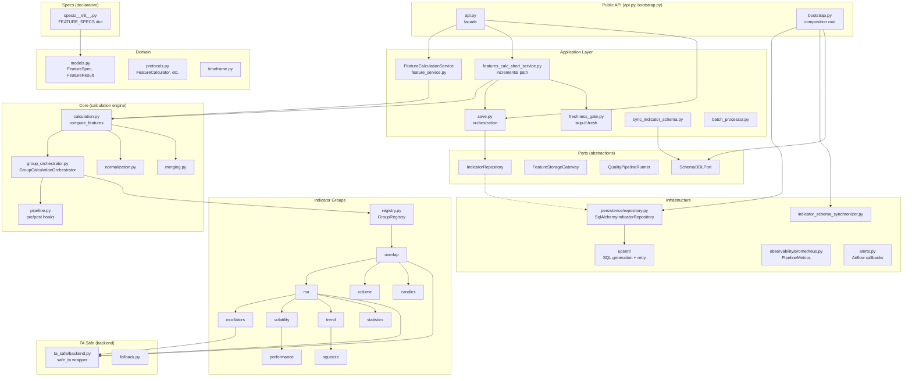
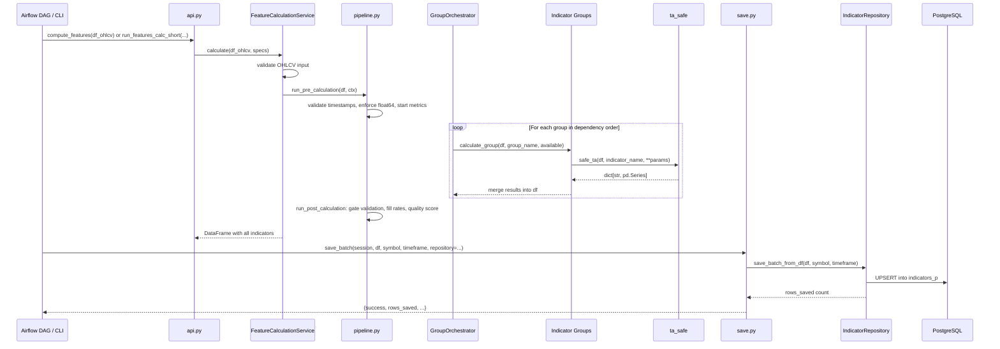

# `src/features`

Technical indicators calculation and persistence module. Takes OHLCV candle data, computes ~100+ indicators across 10 groups, validates results, and upserts them into PostgreSQL (`indicators_p` table).

## Responsibility Boundary

**Owns:**
- Indicator specification registry (what to calculate)
- Indicator group calculation (how to calculate)
- Data validation, normalization, and quality gates
- Persistence to `indicators_p` via upsert
- Schema synchronization (auto-adding indicator columns)
- Prometheus metrics and observability
- Freshness gate (deciding whether a DAG run is needed)

**Does not own:**
- OHLCV ingestion from exchanges (upstream: `src/candles`)
- Top-level CLI (`src/cli/main.py`)
- Airflow DAG definitions (`ops/airflow/dags/`)
- Database migrations or partition DDL (`src/db/`)

## Role in the System

```text
Exchange (OKX)
    |
    v
src/candles  -->  swap_ohlcv_p (PostgreSQL)
                       |
                       v
              src/features (this module)
                       |
                       v
                  indicators_p (PostgreSQL, partitioned)
                       |
                       v
              downstream: backtesting, labeling, ML training
```

Airflow DAGs (`features_calc.py`, `features_calc_short.py`) call into this module's public API to orchestrate scheduled runs.

## Architecture



## Data Flow



## Key Concepts

### Storage Contract

`IndicatorStorageContract` (`storage_contract.py`) is the single source of truth for the `indicators_p` table layout:

| Field | Role |
|-------|------|
| `symbol`, `timeframe`, `timestamp` | Identity / composite PK |
| `calculated_at` | Service metadata |
| Everything else | Feature columns (dynamic, added via schema sync) |

### Indicator Groups

10 groups executed in dependency order (topologically sorted via `networkx`, fallback to numeric `order`):

| Order | Group | Dependencies | Examples |
|-------|-------|-------------|----------|
| 0 | overlap | none | hlc3, hl2, ohlc4, wcp |
| 1 | ma | overlap | sma_20, ema_8, wma_14, hma_21, t3_5 |
| 2 | oscillators | overlap, ma | rsi_14, macd, stoch_k, cci_20, willr |
| 3 | volatility | overlap, ma | atr_14, bb_upper_20, kc_upper, natr |
| 4 | volume | overlap | obv, cmf, vwap, mfi_14, ad |
| 5 | trend | overlap, ma | adx_14, supertrend, psar, ichimoku |
| 6 | squeeze | volatility, trend | ttm_squeeze |
| 7 | candles | overlap | candlestick patterns |
| 8 | statistics | overlap, ma | statistical indicators |
| 9 | performance | overlap, ma, volatility | performance metrics |

Groups self-register via `@GroupRegistry.register(name, order, dependencies)` decorator. All group calculators follow `GroupCalculatorProtocol`: `(df, available, **kwargs) -> dict[str, pd.Series]`.

### TA Safe Layer

`ta_safe/` wraps `pandas_ta` calls with:
- Allowlist enforcement (`ALLOW` set)
- Input validation
- Output normalization to `pd.DataFrame`
- Type coercion to `float64` (avoids `FutureWarning`)
- Fallback implementations when `pandas_ta` functions are unavailable

### Feature Specs

`specs/` declares indicator metadata as `FeatureSpec` dataclasses (name, type, params, required OHLCV columns, dependencies). The combined registry `FEATURE_SPECS: dict[str, FeatureSpec]` is the authoritative list of available indicators.

### Freshness Gate

`freshness_gate.py` checks whether indicators are up-to-date relative to OHLCV data. Used by Airflow DAGs to skip runs when data is already fresh. Compares `max(timestamp)` in `indicators_p` vs `swap_ohlcv_p` with configurable lag tolerances.

## Public API

Entry points exposed through `api.py` and `__init__.py`:

| Function / Class | Purpose |
|-----------------|---------|
| `compute_features(df_ohlcv, ...)` | Calculate all indicators from OHLCV DataFrame |
| `FeatureCalculationService` | DI-friendly service wrapping `compute_features` |
| `create_feature_service(...)` | Factory for `FeatureCalculationService` |
| `run_features_calc_short(...)` | Incremental: fetch latest OHLCV, calculate, save |
| `save_batch(session, df, ...)` | Save indicator DataFrame to PostgreSQL |
| `save_parquet_to_pg(session, path, ...)` | Load parquet + save to PostgreSQL |
| `FeatureApplicationBootstrap` | Composition root bundle (gateway, repository, quality, schema DDL) |
| `create_feature_application_bootstrap(...)` | Factory for the bootstrap bundle |
| `IndicatorStorageContract` | Table metadata constants |
| `FEATURE_SPECS` | Registry of all indicator specifications |

## Ports (Abstractions)

Defined in `ports/`, these are the dependency inversion boundaries:

| Port | Purpose |
|------|---------|
| `IndicatorRepository` | Batched indicator persistence (save, validate, verify) |
| `FeatureStorageGateway` | Fetch OHLCV data, ensure columns exist |
| `FeatureCalculatorBackend` | Backend wrapper (can override TA library selection) |
| `FeatureSaveValidator` | Pre-save validation |
| `FeatureSaveObserver` | Observability during save operations |
| `QualityPipelineRunner` | Data quality pipeline |
| `SchemaDDLPort` | Column DDL operations (ALTER TABLE ADD COLUMN) |
| `PartitionManager` | Partition maintenance |

## Configuration

Configuration is centralized in `src.config.get_settings().features` (`FeaturesSettings`). Key fields:

| Setting | Default | Purpose |
|---------|---------|---------|
| `chunk_size` | - | Rows per calculation chunk |
| `batch_size` | - | Rows per DB upsert batch |
| `max_lookback` | - | Maximum lookback window |
| `volatility_normalize` | - | Enable volatility normalization |
| `normalize_window` | 20 | Window for normalization |
| `min_fill_rate` | - | Minimum acceptable fill rate |
| `max_retries` | - | Upsert retry count |
| `log_memory` | - | Log memory usage during save |
| `force_gc_after_chunk` | - | Force GC after each chunk |

Legacy config functions in `config/settings.py` are deprecated. Use `get_settings().features` directly.

Environment variable override: `FEATURES_<FIELD_NAME>` (e.g., `FEATURES_CHUNK_SIZE=200000`).

TA backend selection: `FEATURES_TA_BACKEND` env var (default: auto-detect).

## Directory Structure

```text
src/features/
    __init__.py              # Public exports
    api.py                   # Public API facade
    bootstrap.py             # Composition root (DI wiring)
    storage_contract.py      # Table metadata constants
    metrics.py               # Legacy metrics
    backfill.py              # Backfill entry point

    application/             # Use cases / orchestration
        feature_service.py       # FeatureCalculationService
        features_calc_short_service.py  # Incremental calculation path
        save.py                  # Save orchestration
        save_validation.py       # Pre-save validators
        save_observer.py         # Save observability
        freshness_gate.py        # Skip-if-fresh logic
        batch_processor.py       # Batch processing
        feature_window.py        # OHLCV window management
        sync_indicator_schema.py # Schema sync use case
        calc.py                  # compute_and_dump_parquet
        save_dependencies.py     # DI helper

    core/                    # Calculation engine
        calculation.py           # compute_features()
        pipeline.py              # Pre/post calculation hooks
        group_orchestrator.py    # GroupCalculationOrchestrator
        group_calculation.py     # compute_features_grouped()
        group_calculator.py      # GroupFeatureCalculator
        group_persister.py       # GroupPersister
        group_metrics.py         # GroupMetricsRecorder
        normalization.py         # Volatility normalization
        merging.py               # Indicator result merging
        dependency_graph.py      # Dependency resolution
        validation.py            # Spec validation
        debug_utils.py           # Debug logging

    domain/                  # Models and protocols
        models.py                # FeatureSpec, FeatureResult, FeatureError
        protocols.py             # FeatureCalculator, OHLCVValidator, etc.
        indicator_specs.py       # Indicator spec helpers
        strategy.py              # Calculation strategies
        timeframe.py             # Timeframe utilities

    specs/                   # Declarative indicator metadata
        candles.py, ma.py, oscillators.py, overlap.py,
        performance.py, statistics.py, trend.py,
        volatility.py, volume.py

    indicator_groups/        # Calculation implementations
        registry.py              # GroupRegistry (decorator-based)
        overlap.py, ma.py, oscillators.py, volatility.py,
        volume.py, trend.py, squeeze.py, candles.py,
        statistics.py, performance.py
        data_cleaner.py          # Data cleaning utilities

    ta_safe/                 # Safe pandas_ta wrapper
        backend.py               # safe_ta() function
        fallback.py              # Fallback implementations
        constants.py             # ALLOW set, backend detection
        validation.py            # Input validation
        normalization.py         # Output normalization
        errors.py                # FeatureCalcError
        bridge.py                # Adapter bridge
        adapters/                # Backend-specific adapters

    infrastructure/          # External integrations
        persistence/             # DB persistence layer
            repository.py           # SqlAlchemyIndicatorRepository
            inserter.py              # Insert orchestration
            data_transformer.py      # Type conversions
            upsert_executor.py       # UPSERT with retry
            schema_cache.py          # Schema caching
            batch_builder.py         # Batch construction
            row_processor.py         # Row-level processing
            validator.py             # DB-level validation
            schema_checker.py        # Schema introspection
            schema_filter.py         # Column filtering
            name_normalizer.py       # Column name normalization
            normalizer.py            # Value normalization
        upsert/                  # SQL generation
            sql_generator.py
            column_introspector.py
            batch_sizer.py
            type_validator.py
        db_operations.py         # Low-level DB queries
        database.py              # Connection helpers
        indicator_schema_synchronizer.py  # Auto-add columns
        schema_ddl_adapter.py    # SchemaDDLPort implementation
        partition_adapter.py     # PartitionManager adapter
        quality_adapter.py       # QualityPipelineRunner adapter
        alerts.py                # Airflow failure/SLA callbacks
        versioning.py            # Algorithm version tracking
        snapshot_manager.py      # Calculation snapshots
        upsert_builder.py        # Legacy upsert builder
        upsert_optimizer.py      # Batch size optimization
        diagnostics.py           # Runtime diagnostics
        indicator_registry.py    # DB indicator registry
        models.py                # Infrastructure models

    observability/           # Metrics and logging
        prometheus.py            # PipelineMetrics (Pushgateway)
        metrics.py               # Fill rate, quality score
        logging.py               # Structured logging
        error_handling.py        # Error handling
        indicators_logging.py    # Indicator-specific logging
        quality_store.py         # Quality data store
        traceability.py          # Feature tracing

    ports/                   # Dependency inversion interfaces
        persistence.py, storage.py, save.py,
        calculator_backend.py, partition.py,
        quality.py, schema_ddl.py

    validation/              # Input/output validation
        feature_validator.py     # OHLCV + spec validation
        gate_validator.py        # Data gate (fill rate checks)
        data_validator.py        # General data quality
        code_validator.py        # Code-level validation
        chain.py                 # Validation chaining

    schema/                  # Schema management
        schema_manager.py        # Schema operations
        name_aliases.py          # Column name aliasing

    presets/                  # Predefined calculation configs
        features_calc_short_v1.py  # Short-path indicator subset

    config/                  # Module configuration (deprecated)
        settings.py              # Legacy config adapters

    cli/                     # Module-level CLI
        main.py                  # CLI entry point
        check_database_setup.py  # DB setup verification
        schema_check.py          # Schema validation

    tools/                   # Developer tools
        generate_schema.py       # Schema generation

    utils/                   # Utilities
        dependency_resolver.py, indicator_utils.py,
        time_utils.py, memlog.py, utils.py

    tests/                   # In-module test config
        conftest.py
```

## Quality Gates

The pipeline applies several validation stages:

1. **Pre-calculation**: OHLCV validation (required columns, non-null, numeric types), timestamp validation (UTC ms, monotonic, no duplicates)
2. **Per-group**: Each group calculator returns `dict[str, pd.Series]` (LSP-enforced via `GroupCalculatorProtocol`)
3. **Post-calculation**: Data gate validation (fill rates per group), quality score (NaN ratio + outlier ratio)
4. **Pre-save**: DataFrame structure validation before persistence
5. **Freshness gate**: Lag tolerance checks per timeframe (fast: 240s, slow: 1200s)

Failed groups are tracked in `PipelineContext.failed_groups` and recorded as `data_status='inc'` (incomplete). Gate failures are non-blocking -- data is saved with metadata flags.

## Observability

### Prometheus Metrics

`PipelineMetrics` singleton (`observability/prometheus.py`) exposes via Pushgateway:

| Metric | Type | Description |
|--------|------|-------------|
| `pklpo_features_rows_written_total` | Counter | Rows written to DB |
| `pklpo_upsert_failures_total` | Counter | Failed upserts |
| `pklpo_data_freshness_lag_seconds` | Gauge | Lag from expected bar close |
| `pklpo_data_fill_rate` | Gauge | Data completeness (0-1) |
| `pklpo_data_quality_score` | Gauge | Composite quality (0-1) |
| `pklpo_features_calculation_duration_seconds` | Histogram | Calculation time |
| `pklpo_upsert_duration_seconds` | Histogram | Upsert time |

Graceful degradation: all metrics are no-ops if `prometheus-client` is not installed or Pushgateway is unreachable.

### Logging

Uses `src.logging` with category-based loggers (`LogCategory.CALC`, `LogCategory.DIAG`). Key log points:
- Pre/post calculation milestones with `run_id`
- Per-group fill rates
- Timestamp validation results
- Save operation outcomes with row counts

### Feature Tracing

`FeatureTracer` (`observability/traceability.py`) provides per-feature metadata tracking, toggle-able via `enable_tracing()` / `disable_tracing()`.

## CLI Usage

Module CLI (`python -m src.features`):

```bash
# Calculate indicators from OHLCV file
python -m src.features calculate input.parquet output.parquet \
    --symbol BTC-USDT-SWAP --timeframe 1m

# Calculate with legacy (non-streaming) method
python -m src.features calculate input.csv output.parquet \
    --symbol BTC-USDT-SWAP --timeframe 5m --legacy --volatility-normalize

# Save parquet to PostgreSQL
python -m src.features save output.parquet \
    --symbol BTC-USDT-SWAP --timeframe 1m --validate

# Validate data quality
python -m src.features validate input.parquet --data-type features --strict

# Test parquet file integrity
python -m src.features test-parquet output.parquet

# Test database connection
python -m src.features test-database

# Full pipeline: calculate -> validate -> save
python -m src.features pipeline input.parquet output.parquet \
    --symbol BTC-USDT-SWAP --timeframe 1m --validate

# List calculation snapshots
python -m src.features snapshots-list --limit 10 --status completed

# Show snapshot details
python -m src.features snapshots-show <snapshot_id> --show-config
```

## Testing

```bash
# Run all feature tests
pytest tests/features/ -v

# Run specific test category
pytest tests/features/tests/ -v
pytest tests/features/domain/ -v
pytest tests/features/core/ -v

# Run benchmarks
pytest tests/features/benchmarks/ -v
```

79 test files across `tests/features/`.

## Failure and Retry Behavior

- **Group calculation failures**: Isolated per-group. Failed groups are recorded in `ctx.failed_groups`; remaining groups continue. Result DataFrame gets `data_status='inc'`.
- **Upsert retries**: Handled by `upsert_executor.py` with configurable `max_retries` and exponential backoff (`retry_delay_base`).
- **Save failures**: Session is rolled back on exception. Result dict returns `{success: False, error: ...}`.
- **TA function failures**: `safe_ta()` raises `FeatureCalcError`, caught at group level.
- **Freshness gate**: Returns `True` (run) on any error or missing data; `False` (skip) only when all timeframes are verified fresh.

## Extension Guide

### Adding a New Indicator Group

1. Create `src/features/indicator_groups/new_group.py`
2. Register with decorator:
   ```python
   from .registry import GroupRegistry

   @GroupRegistry.register("new_group", order=10, dependencies=["overlap", "ma"])
   def calc_new_group_indicators(df, available, **kwargs):
       result = {}
       # ... calculate indicators ...
       return result  # dict[str, pd.Series]
   ```
3. Add corresponding specs in `src/features/specs/new_group.py`
4. Import the module in `indicator_groups/__init__.py`
5. Add metadata entry to `GROUP_METADATA` dict

### Adding a New Indicator to an Existing Group

1. Add `FeatureSpec` entry in the appropriate `specs/*.py` file
2. Add calculation logic in the corresponding `indicator_groups/*.py` calculator function
3. The indicator column will be auto-created in `indicators_p` via schema sync

### Swapping the TA Backend

Set `FEATURES_TA_BACKEND` env var or pass `backend_id` to `create_feature_service()`. The `DefaultFeatureCalculatorBackend` temporarily overrides the env var for each calculation call.

## Limitations

- **Single-threaded calculation**: Group calculation runs sequentially (dependency order). No parallel group execution.
- **pandas_ta dependency**: Core calculation depends on `pandas_ta`. If unavailable, `compute_features` import raises `ImportError`.
- **In-memory processing**: Entire OHLCV window must fit in memory for calculation. No streaming/chunked calculation at the group level.
- **PostgreSQL only**: Persistence layer is tightly coupled to PostgreSQL (upsert SQL, schema introspection). The `IndicatorRepository` port exists but has only one implementation.
